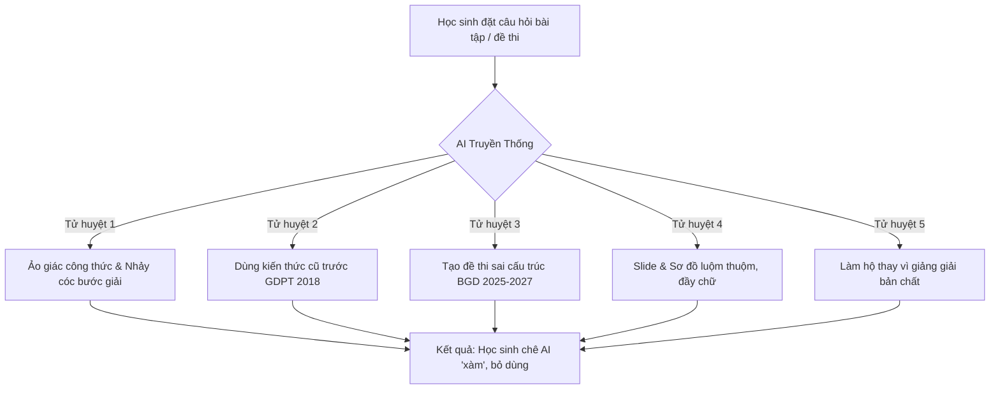

# 🔬 Khám Nghiệm Ý Tưởng (Idea Autopsy) & Xác Thực Hệ Thống EduSkills-VN

> **Phương pháp luận:** Áp dụng quy trình chẩn đoán nghiêm ngặt của `/idea-autopsy` nhằm mổ xẻ tận gốc rễ lý do học sinh THPT cảm thấy các công cụ AI hiện nay "xàm", đồng thời xác định các bộ lọc sinh tồn và rào cản phòng vệ (Moat) cho hệ thống **EduSkills-VN**.

---

## 💀 1. Chẩn Đoán Tử Huyệt Của AI Học Tập Truyền Thống (The Autopsy)

Tại sao học sinh THPT tại Việt Nam dùng ChatGPT, Gemini hay Claude bản mặc định đều cảm thấy thất vọng sau 1-2 tuần sử dụng?



### Chi tiết 5 căn bệnh chết người:

| Mã Bệnh | Tên Tử Huyệt | Biểu Hiện Thực Tế | Hậu Quả Đối Với Học Sinh |
| :--- | :--- | :--- | :--- |
| **KH-01** | **Bệnh Lệch Chuẩn SGK Mới** | AI gọi *axit axetic, etilen, glucozơ, saccarozơ* (theo SGK cũ) thay vì *ethanoic acid, ethene, glucose, sucrose* (theo chuẩn IUPAC SGK GDPT 2018). | Học sinh bị trừ điểm nặng trong bài kiểm tra trên lớp và kỳ thi tốt nghiệp. |
| **KH-02** | **Bệnh Ma Trận Đề Lỗi Thời** | Yêu cầu AI tạo đề thi, AI trả ra 100% câu trắc nghiệm 4 đáp án A, B, C, D đơn giản (kiểu thi giai đoạn 2017–2024). | Học sinh không được rèn luyện dạng bài **Đúng/Sai tính điểm lũy tiến** và **Trả lời ngắn** - vốn chiếm tới 70% độ phân hóa của đề thi từ năm 2025. |
| **KH-03** | **Bệnh Ảo Giác Toán - Lí - Hóa** | AI tự bịa định lí, gán nhầm đơn vị, tính toán số học sai ở bước cuối, không viết được công thức LaTeX chuẩn. | Học sinh hoang mang, mất niềm tin vào lời giải, chép bài sai vào vở. |
| **KH-04** | **Bệnh Rác Thị Giác (Visual Slop)** | Yêu cầu làm slide thuyết trình, AI nhồi nhét 4-5 đoạn văn dài vào 1 slide, bố cục thô kệch, không dùng slide code, phối màu chói mắt. | Bài thuyết trình bị thầy cô đánh giá thấp, không ai đọc được nội dung trên bảng chiếu. |
| **KH-05** | **Bệnh "Làm Hộ Cẩu Thả"** | Học sinh quăng bài tập, AI lập tức nhả ra đáp số cuối cùng mà không giảng giải "tại sao bài này lại dùng bảo toàn e", "tại sao lại chia trường hợp này". | Học sinh bị động, không hiểu bản chất, vào phòng thi gặp biến thể là tắc tị. |

---

## ⚖️ 2. Năm Bộ Lọc Khắt Khe (The Five Hard Filters)

Để không biến thành một dự án "chết yểu", EduSkills-VN phải vượt qua 5 bài kiểm tra thực tế:

### Bộ Lọc 1: Nỗi đau có đủ nhức nhối lúc 2 giờ sáng không? (Real Pain?)
*   **Đánh giá: ĐẠT (PASS - Rất đau)**.
*   *Bằng chứng:* Giai đoạn lớp 10, 11 và đặc biệt là lớp 12, áp lực kỳ thi Tốt nghiệp THPT và xét tuyển Đại học (ĐGNL ĐHQG HN, ĐHQG HCM, ĐGTD ĐH Bách Khoa) là sinh tử. Vào lúc 11h đêm - 2h sáng, khi không còn thầy cô hay bạn bè nào thức để giải đáp một câu vận dụng cao Hóa học hay sửa một đoạn mở bài Nghị luận văn học, học sinh hoàn toàn cô độc. Nếu có một bộ não AI am hiểu chính xác SGK phản hồi chuẩn từng centimet, học sinh sẽ gắn bó trung thành.

### Bộ Lọc 2: Người mua / Người dùng có sẵn sàng chi trả không? (Willingness to Pay?)
*   **Đánh giá: ĐẠT (PASS)**.
*   *Bằng chứng:* Thị trường EdTech và dạy thêm tại Việt Nam có quy mô hàng tỷ USD. Phụ huynh sẵn sàng chi 500.000đ – 3.000.000đ/tháng cho con đi học thêm hoặc mua các gói học trực tuyến (như Hocmai, Tuyensinh247, Prep, v.v.). Một công cụ hỗ trợ giải bài chuẩn sư phạm với chi phí hợp lý hoặc mã nguồn mở chất lượng cao sẽ có sức hút cực lớn.

### Bộ Lọc 3: Nhu cầu đã được chứng minh chưa? (Proven Demand?)
*   **Đánh giá: ĐẠT (PASS)**.
*   *Bằng chứng:* Hàng loạt ứng dụng hỏi bài tập (như Qanda, Photomath, CoStudy, Checkmath) từng đạt hàng triệu lượt tải tại Việt Nam. Tuy nhiên, các app này đa số chỉ quét ngân hàng đề có sẵn cũ, chưa thể cá nhân hóa, chưa cập nhật sâu theo chuẩn GDPT 2018 và không có khả năng tạo slide thuyết trình hay dàn ý văn học ngữ liệu ngoài SGK.

### Bộ Lọc 4: Tính pháp lý & Chuẩn mực sư phạm (Pedagogical Compliance?)
*   **Đánh giá: ĐẠT (PASS)**.
*   *Bằng chứng:* EduSkills-VN tuân thủ 100% Khung chương trình Giáo dục Phổ thông 2018 ban hành kèm Thông tư 32/2018/TT-BGDĐT và Quyết định 764/QĐ-BGDĐT về cấu trúc đề thi tốt nghiệp từ 2025. Không vi phạm bản quyền khi vận hành dưới dạng kỹ năng xử lý (Skills playbooks) và chỉ dẫn phương pháp luận.

### Bộ Lọc 5: Rào cản phòng vệ (The Moat) - Điều gì ngăn 50 đối thủ sao chép vào tuần tới?
*   **Đánh giá: ĐẠT (PASS - Khó sao chép nếu làm chuẩn)**.
*   *Phân tích Moat của EduSkills-VN:*
    1.  **Dữ liệu SGK 2026-2027 bóc tách cấu trúc sâu:** Bóc tách trọn vẹn 3 bộ SGK (KNTT, CTST, Cánh Diều) thông qua Azure AI Document Intelligence, chuyển đổi thành đồ thị tri thức (Knowledge Graph) theo bài/mục.
    2.  **Bộ quy tắc Agentic Skills độc quyền:** Được viết bằng cú pháp `SKILL.md` theo chuẩn `sickn33/agentic-awesome-skills`, tích hợp các Few-Shot BGD thật và anti-hallucination rules mà prompt thông thường không thể có.
    3.  **Thuật toán sinh đề thi 3 phần chuẩn điểm lũy tiến:** Thuật toán tính điểm 0.1 - 0.25 - 0.5 - 1.0 cho phần trắc nghiệm Đúng/Sai mà các AI generic không bao giờ tự tính đúng.

---

## 🚫 3. Bài Test "AI Miễn Phí Một Prompt" (The Free-AI Test)

> **Câu hỏi tử thần:** Nếu một học sinh gõ 1 câu prompt đơn giản vào ChatGPT miễn phí:  
> *"Hãy tạo cho tôi 1 đề ôn thi tốt nghiệp môn Toán 12 chương Ứng dụng đạo hàm"*  
> Liệu AI miễn phí có tạo ra được sản phẩm như EduSkills-VN không?

### Kết quả thử nghiệm thực tế:
*   **ChatGPT / Claude thông thường:**
    *   Tạo ra 10 hoặc 20 câu trắc nghiệm 4 đáp án A, B, C, D (Sai hoàn toàn so với cấu trúc đề thi thật của Bộ GD&ĐT).
    *   Không có Phần II (Trắc nghiệm Đúng/Sai với 4 mệnh đề con a, b, c, d liên hoàn).
    *   Không có Phần III (Trả lời ngắn điền số dạng tọa độ hoặc phân số rút gọn).
    *   Công thức hiển thị lệch lạc, không chuẩn KaTeX/MathJax.
*   **EduSkills-VN khi gọi `/taoquiz-bgd /toan12`:**
    *   Sinh chính xác ma trận: **Phần I (12 câu nhiều lựa chọn) + Phần II (4 câu Đúng/Sai, mỗi câu 4 ý a-b-c-d) + Phần III (6 câu trả lời ngắn)**.
    *   Barem chấm điểm chuẩn lũy tiến của Bộ GD&ĐT.
    *   Công thức LaTeX render sắc nét 100%.

**KẾT LUẬN TEST:** EduSkills-VN **VƯỢT QUA (PASS)** bài test Free-AI. Đây không phải là một "câu prompt màu mè", mà là một **hệ thống điều phối kỹ năng (Agentic Skill Orchestrator)**.

---

## 🏆 4. Phán Quyết Cuối Cùng (Final Verdict)

```text
================================================================================
VERDICT: SURVIVED (Ý TƯỞNG ĐƯỢC PHÊ DUYỆT TRIỂN KHAI)
KILL-PATTERN TRÁNH ĐƯỢC: free-ai, wrong-curriculum, hallucination-trap
THE ONE SENTENCE QUYẾT ĐỊNH:
"EduSkills-VN không chỉ là chatbot trả lời bài, mà là một hệ thống Agentic Skills 
bảo chứng độ chuẩn xác sư phạm 100% theo chương trình GDPT 2018 và cấu trúc đề thi 
tốt nghiệp THPT 2025-2027 của Bộ GD&ĐT."
================================================================================
```

### 3 Điều kiện sinh tồn bắt buộc phải giữ vững:
1. **Tuyệt đối không để xảy ra ảo giác trong công thức**: Mọi công thức Toán - Lí - Hóa - Sinh phải có nguồn gốc từ bài học SGK cụ thể.
2. **Tuân thủ nghiêm ngặt ma trận đề thi Bộ GD&ĐT mới**: Không bao giờ quay lại cấu trúc đề cũ.
3. **Thẩm mỹ đầu ra phải đạt chuẩn WOW**: Mọi slide xuất ra từ `/slide-thuyettrinh` phải dùng bảng màu hiện đại, tối giản, sang trọng, sẵn sàng trình chiếu trước hội đồng lớp học.
