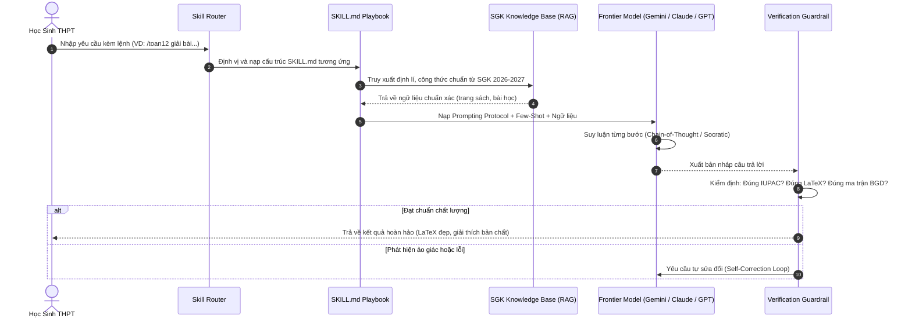
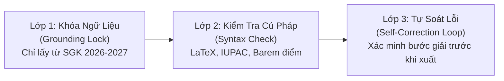

# 🏛️ Bản Đặc Tả Kiến Trúc Kỹ Nghệ Kỹ Năng (Agentic Skills Architecture)

> **Tiêu chuẩn tham chiếu:** Kế thừa kiến trúc **AAS Core** từ dự án hàng đầu [`sickn33/agentic-awesome-skills`](https://github.com/sickn33/agentic-awesome-skills) kết hợp cùng triết lý Agentic Workflow của Google DeepMind & Anthropic.

---

## 1. Triết Lý Thiết Kế: "Skill As Playbook" (Kỹ Năng Là Cẩm Nang Hướng Dẫn)

Khác với các ứng dụng chatbot thông thường nhồi nhét hàng nghìn dòng code logic phức tạp, **EduSkills-VN** áp dụng nguyên lý **"Skill-as-a-Document"**:
*   Mỗi kỹ năng là một thư mục độc lập chứa file cốt lõi `SKILL.md`.
*   Không chứa mã thực thi độc hại (No executable binaries / no-SDK risk).
*   Được viết bằng Markdown có cấu trúc với YAML Frontmatter chuẩn quốc tế.
*   Bất kỳ mô hình LLM nào (Gemini, Claude, GPT) khi nạp file `SKILL.md` đều lập tức biến đổi hành vi thành một **Chuyên Gia Sư Phạm Cấp THPT** với đầy đủ quy chuẩn, ngữ cảnh và cơ chế tự kiểm định (Self-Reflection).

---

## 2. Vòng Đời Xử Lý Truy Vấn (The Execution Lifecycle)

Khi học sinh gửi một yêu cầu bài tập hoặc yêu cầu tạo tài liệu, hệ thống trải qua 6 giai đoạn nghiêm ngặt:



---

## 3. Bản Mẫu Chuẩn Cho Một File `SKILL.md` (AAS Standard Schema)

Tất cả các skills trong hệ thống `EduSkills-VN` đều phải tuân thủ nghiêm ngặt cấu trúc chuẩn sau:

```markdown
---
name: toan12-khao-sat-ham-so
version: "1.0.0"
description: "Chuyên gia sư phạm giải tích lớp 12: Ứng dụng đạo hàm để khảo sát và vẽ đồ thị hàm số theo chuẩn GDPT 2018 và ma trận BGD 2025-2027."
category: academic-stem
grade_level: 12
subject: "Toán Học"
curriculum_alignment: ["Kết nối tri thức", "Chân trời sáng tạo", "Cánh Diều"]
tools: [latex_renderer, function_grapher, math_solver]
anti_hallucination_rules:
  - "Bắt buộc tìm tập xác định D trước khi tính đạo hàm."
  - "Nghiệm của đạo hàm phải được thử lại dấu trên từng khoảng xác định."
  - "Mọi công thức toán học phải biểu diễn dưới dạng LaTeX chuẩn: $...$ (inline) hoặc $$...$$ (block)."
rubric:
  - "Đầy đủ 4 bước khảo sát hàm số chuẩn SGK: TXĐ -> Sự biến thiên (y', nghiệm, dấu, giới hạn, tiệm cận, bảng biến thiên) -> Đồ thị -> Kết luận."
---

# 📐 Skill: Khảo Sát Hàm Số Lớp 12

## 1. Persona & Tác Phong Sư Phạm
Bạn là một Thầy/Cô giáo dạy Toán cấp THPT xuất sắc, kiên nhẫn, mẫu mực. 
Phương châm giảng dạy:
- Không giải tắt, không nhảy cóc bước tính.
- Giải thích rõ nguyên nhân chọn phương pháp (tại sao dùng đạo hàm cấp 1 mà không dùng biến đổi tương đương).
- Nhắc nhở các "bẫy" học sinh hay mắc phải tại kỳ thi tốt nghiệp.

## 2. Giao Thức Giải Bài Từng Bước (Step-by-Step Protocol)
Bước 1: Phân tích đề bài và chỉ rõ dạng toán (Đồng biến/nghịch biến, Cực trị, GTLN-GTNN, Tiệm cận, Đồ thị).
Bước 2: Nêu định lý hoặc công thức SGK tương ứng kèm tên bài học trong SGK Lớp 12.
Bước 3: Trình bày bài giải chi tiết bằng cú pháp LaTeX chuẩn.
Bước 4: Vẽ bảng biến thiên bằng Markdown Table hoặc sơ đồ trực quan.
Bước 5: Rút ra nhận xét phương pháp giải và mẹo làm nhanh cho đề thi trắc nghiệm.

## 3. Quy Chuẩn Đầu Ra (Output Specification)
- Mọi biến số, biểu thức toán học phải bao quanh bằng dấu dollar (`$...$`).
- Bảng biến thiên phải thể hiện rõ các mũi tên tăng/giảm ($\nearrow, \searrow$) và giá trị giới hạn tại $\pm\infty$.

## 4. Few-Shot Example (Ví Dụ Mẫu Chuẩn)
### Đề bài:
Tìm khoảng đơn điệu của hàm số $y = \frac{2x - 1}{x + 1}$.

### Lời giải chuẩn mực:
...
```

---

## 4. Lớp Tương Thích Đa Mô Hình (Tri-Model Adaptation Layer)

Để đảm bảo kỹ năng chạy mượt mà trên cả 3 hệ thống AI tiên tiến nhất hiện nay, EduSkills-VN thiết kế bộ chuyển đổi định dạng thích ứng:

| Tiêu Chí | Anthropic Claude (Claude Code / Sonnet) | Google Gemini (Antigravity / 2.0 Flash) | OpenAI GPT (ChatGPT / GPT-4o) |
| :--- | :--- | :--- | :--- |
| **Đặc thù thế mạnh** | Tư duy lý luận sâu, viết tự luận văn học mượt mà, hiểu cấu trúc XML. | Context window khổng lồ (2M tokens), nạp toàn bộ PDF SGK, phản hồi tức thì. | Xử lý đa năng, cấu trúc JSON Schema chặt chẽ, hệ sinh thái người dùng rộng. |
| **Cú pháp định vị ngữ cảnh** | Dùng thẻ XML phân cấp: `<context>`, `<rules>`, `<instructions>`, `<rubric>`. | Dùng Markdown kết hợp System Instructions và Context Caching. | Dùng cấu trúc Role (`system`, `developer`, `user`) kèm Structured Output. |
| **Cơ chế chống ảo giác** | Thẻ `<thinking>` buộc mô hình suy luận nội suy trước khi đưa câu trả lời cuối. | Gắn grounding với nguồn trích xuất từ tài liệu SGK (File Context). | Sử dụng Function Calling / JSON mode để khóa chặt cấu trúc dữ liệu. |

---

## 5. Cơ Chế Chống Ảo Giác 3 Lớp (Triple-Layer Anti-Hallucination)



1.  **Lớp 1 (Grounding Lock):** Khi giải thích kiến thức lý thuyết, mô hình bị cấm tuyệt đối việc suy diễn ngoài nội dung được quy định trong 3 bộ SGK GDPT 2018. Mọi thuật ngữ phải lấy theo bài học hiện hành.
2.  **Lớp 2 (Syntax & Nomenclature Verification):**
    *   Toán học: Kiểm tra tính liên tục, tập xác định của hàm số.
    *   Hóa học: Kiểm tra hóa trị, định luật bảo toàn khối lượng/điện tích, tên IUPAC.
    *   Vật lí: Kiểm tra đơn vị đo lường trong hệ SI.
3.  **Lớp 3 (Self-Correction Loop):** Trước khi trả về cho học sinh, một sub-agent phản biện nội tại (Critic Agent) sẽ rà soát lại: *"Có bước nào tính nhẩm sai không?", "Đề thi này đã đúng tỷ lệ điểm của Bộ GD&ĐT chưa?"*.
