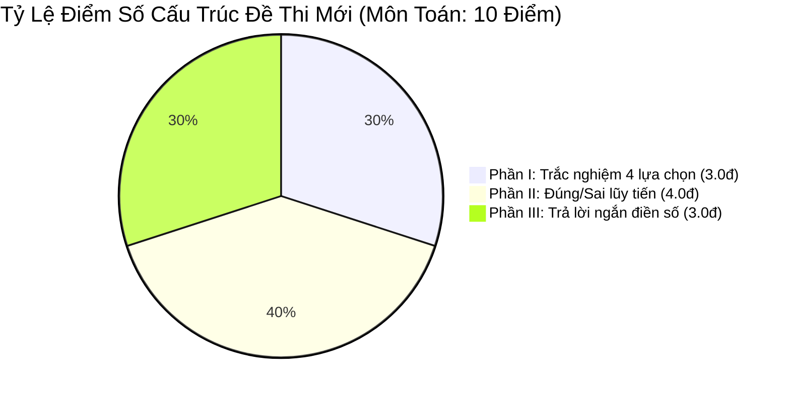

# 📜 Quy Chuẩn GDPT 2018 & Bộ SGK Thống Nhất Toàn Quốc 2026–2027 Của Bộ GD&ĐT

> **Căn cứ chuyên môn & pháp lý:**  
> - Nghị quyết của Quốc hội & Quyết định của Bộ Giáo dục & Đào tạo về việc **Thống nhất một bộ Sách giáo khoa chuẩn toàn quốc từ năm học 2026** (kế thừa và tinh hoa hóa từ 3 bộ sách Kết nối tri thức, Chân trời sáng tạo, Cánh Diều).  
> - Quyết định số 764/QĐ-BGDĐT quy định về Cấu trúc định dạng đề thi Kỳ thi tốt nghiệp THPT từ năm 2025.  
> - Toàn bộ dữ liệu thực tế được chuẩn hóa trực tiếp theo kho SGK PDF Lớp 10, 11, 12 hiện có trong thư mục `sgk/`.

---

## 1. Sự Kiện Chuyển Đổi 2026: Bộ SGK Thống Nhất Toàn Quốc

Khác với giai đoạn 2020–2025 học sinh học theo 3 bộ sách phân tán, **từ năm 2026, Bộ Giáo dục & Đào tạo chính thức gộp và thống nhất một bộ SGK chuẩn mực duy nhất trên toàn quốc**.
*   Toàn bộ kho dữ liệu SGK được số hóa và đồng bộ lên **Google Drive Cloud Storage** tốc độ cao (tránh vượt dung lượng 100MB của GitHub):
    - 📗 **SGK Lớp 10 (GDPT 2018):** [Google Drive Folder Lớp 10](https://drive.google.com/drive/folders/1H4BU2OMP1h5VJUtF8iQp9Dpmo40oHX6o?usp=drive_link)
    - 📘 **SGK Lớp 11 (GDPT 2018):** [Google Drive Folder Lớp 11](https://drive.google.com/drive/folders/1w8QOaRc_V5It9Xh0PvT_QwO_G7V22jZr?usp=drive_link)
    - 📙 **SGK Lớp 12 (SGK Thống Nhất 2026-2027):** [Google Drive Folder Lớp 12](https://drive.google.com/drive/folders/1I3h4nfdJTO5KdPsD4UWYdYJlMXQL1YwD?usp=drive_link)
*   Hệ thống **EduSkills-VN** được căn chỉnh chính xác 100% theo các bài học, thuật ngữ và bài tập thực hành trong bộ sách thống nhất này.
*   **Phương thức nạp dữ liệu chuẩn (Standard Data Ingestion):**
    1. Khi tương tác với Google Gemini / NotebookLM: Kết nối trực tiếp Drive folder tương ứng để đối chiếu ngữ cảnh sách giáo khoa.
    2. Khi tương tác với Claude Code / Claude Projects / ChatGPT: Tải file PDF bài học cụ thể từ Drive và đính kèm vào kho tri thức (Knowledge Base).

---

## 2. Ma Trận Đề Thi Tốt Nghiệp THPT Từ Năm 2025–2027 (3 Phần Bắt Buộc)

### PHẦN I: Trắc Nghiệm Nhiều Lựa Chọn (Single Choice)
*   Mỗi câu có 4 phương án $A, B, C, D$, chọn 1 đáp án đúng duy nhất.
*   Thang điểm: 0.25 điểm / câu.
*   Cấp độ: Nhận biết và Thông hiểu.

### PHẦN II: Trắc Nghiệm Đúng / Sai Lũy Tiến Điểm (True/False Compound)
*   Mỗi câu hỏi có 1 phần dẫn bài toán tổng quát và 4 ý $a), b), c), d)$.
*   **Thang điểm tính lũy tiến bắt buộc:**
    *   Đúng **01 ý**: được **0.1 điểm**.
    *   Đúng **02 ý**: được **0.25 điểm**.
    *   Đúng **03 ý**: được **0.5 điểm**.
    *   Đúng cả **04 ý**: được **1.0 điểm**.
*   *Mục đích:* Chống khoanh bừa, phân hóa học sinh khá - giỏi cực mạnh.

### PHẦN III: Trắc Nghiệm Dạng Trả Lời Ngắn (Short Answer)
*   Thí sinh tự giải và điền đáp số số học (tối đa 4 ký tự, có thể có dấu âm hoặc dấu phẩy).
*   Thang điểm: 0.5 điểm/câu (Toán) hoặc 0.25 điểm/câu (Lí, Hóa, Sinh).
*   Cấp độ: Vận dụng và Vận dụng cao.

---

## 3. Quy Trình Tạo Đề Thi "Document-First" Bắt Buộc

Đối với meta-skill `/taoquiz-bgd`:
1.  **Học sinh bắt buộc phải gửi tài liệu/nội dung bài học trước.** AI không sinh đề chung chung hay bịa đề rác ngoài chương trình.
2.  **Độ khó cao:** Tập trung vào các bẫy tư duy thực tế, tính toán logic và các câu hỏi phân hóa 8+, 9+, 10 điểm trong kỳ thi tốt nghiệp.

---

## 4. Chuẩn Danh Pháp Hóa Học IUPAC Quốc Tế

| Tên Cũ (Pre-2018 - CẤM DÙNG) | Danh Pháp Chuẩn IUPAC SGK Thống Nhất 2026 | Công Thức Hóa Học |
| :--- | :--- | :--- |
| Axit axetic | **Ethanoic acid** (hoặc Acetic acid) | $CH_3COOH$ |
| Rượu etylic | **Ethanol** | $C_2H_5OH$ |
| Khí etilen | **Ethene** | $C_2H_4$ |
| Axit sunfuric | **Sulfuric acid** | $H_2SO_4$ |
| Natri hidroxit | **Sodium hydroxide** | $NaOH$ |
| Đồng, Sắt, Kẽm | **Copper, Iron, Zinc** | $Cu, Fe, Zn$ |
