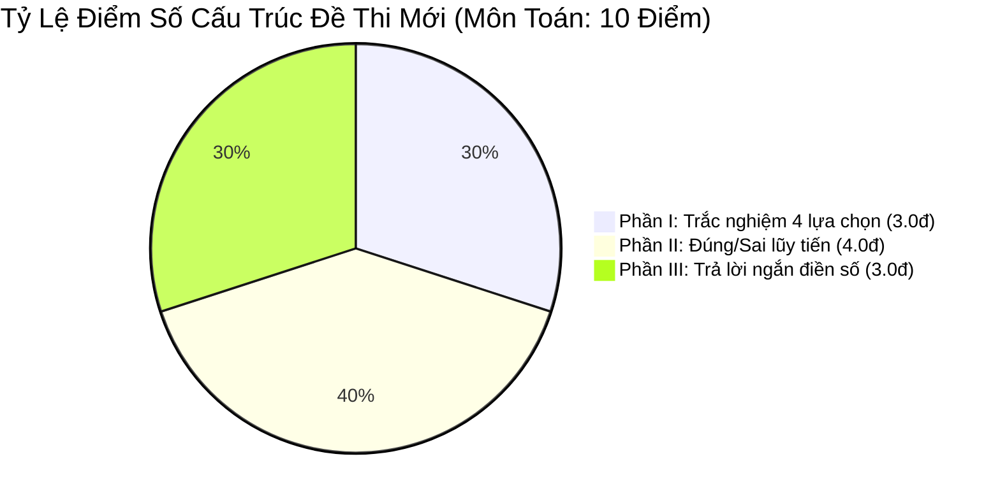

# 📜 Quy Chuẩn GDPT 2018 & Định Dạng Đề Thi Tốt Nghiệp THPT 2025–2027 Của Bộ GD&ĐT

> **Căn cứ pháp lý:**  
> - Thông tư số 32/2018/TT-BGDĐT ban hành Chương trình Giáo dục phổ thông mới (GDPT 2018).  
> - Quyết định số 764/QĐ-BGDĐT quy định về Cấu trúc định dạng đề thi Kỳ thi tốt nghiệp THPT từ năm 2025.  
> - Các hướng dẫn chuyên môn và đề minh họa chính thức của Bộ Giáo dục & Đào tạo.

---

## 1. Bản Đồ Chương Trình GDPT 2018 & Ba Bộ Sách Giáo Khoa

Chương trình GDPT 2018 chuyển từ **"truyền thụ kiến thức một chiều"** sang **"phát triển phẩm chất và năng lực người học"**. Giáo trình được biên soạn thành 3 bộ sách chính:
1.  **Kết nối tri thức với cuộc sống** (Nhà xuất bản Giáo dục Việt Nam)
2.  **Chân trời sáng tạo** (Nhà xuất bản Giáo dục Việt Nam)
3.  **Cánh Diều** (NXB ĐH Sư phạm Hà Nội & NXB ĐH Sư phạm TP.HCM)

> [!IMPORTANT]
> **Nguyên tắc cốt lõi của EduSkills-VN:**  
> Đề thi và tài liệu học tập không được lấy ngữ liệu độc quyền của riêng một bộ sách nào để tránh thiên vị. Kiến thức phải chuẩn hóa theo **Yêu cầu cần đạt (YCCĐ)** được ban hành trong khung chương trình tổng thể của Bộ.

---

## 2. Ma Trận & Định Dạng Đề Thi Tốt Nghiệp THPT Từ Năm 2025–2027

Kỳ thi tốt nghiệp THPT từ năm 2025 có sự thay đổi mang tính cách mạng về cấu trúc đề thi trắc nghiệm đối với tất cả các môn khoa học (Toán, Vật lí, Hóa học, Sinh học, Lịch sử, Địa lí, Giáo dục Kinh tế & Pháp luật, Tin học, Công nghệ).

Đề thi bao gồm **3 phần thi riêng biệt**:



---

### PHẦN I: Trắc Nghiệm Nhiều Lựa Chọn (Single Choice)
*   **Hình thức:** Câu hỏi trắc nghiệm truyền thống gồm 4 phương án $A, B, C, D$, thí sinh chỉ chọn duy nhất 1 phương án đúng.
*   **Số lượng & Thang điểm:**
    *   Môn Toán: 12 câu $\times$ 0.25 điểm = **3.0 điểm**.
    *   Môn Lí, Hóa, Sinh, Sử, Địa, KTPL, Tin, Công nghệ: 18 câu $\times$ 0.25 điểm = **4.5 điểm**.
*   **Cấp độ tư duy:** Chủ yếu ở mức độ **Nhận biết** và **Thông hiểu**.

---

### PHẦN II: Trắc Nghiệm Đúng / Sai (True / False Compound)
*   **Hình thức:** Mỗi câu hỏi có một phần dẫn chung (ngữ cảnh/đồ thị/thí nghiệm) và 4 mệnh đề nhỏ được đánh dấu $a), b), c), d)$. Thí sinh phải xác định từng ý là **Đúng** hay **Sai**.
*   **Cơ chế tính điểm lũy tiến ĐẶC BIỆT của Bộ GD&ĐT:**
    *   Thí sinh chỉ chọn chính xác **01 ý** trong 1 câu: được **0.1 điểm**.
    *   Thí sinh chỉ chọn chính xác **02 ý** trong 1 câu: được **0.25 điểm**.
    *   Thí sinh chỉ chọn chính xác **03 ý** trong 1 câu: được **0.5 điểm**.
    *   Thí sinh chọn chính xác cả **04 ý** trong 1 câu: được **1.0 điểm**.
*   **Số lượng câu hỏi:**
    *   Môn Toán: 4 câu $\times$ 1.0 điểm tối đa = **4.0 điểm**.
    *   Môn Lí, Hóa, Sinh, Sử, Địa, KTPL, Tin, Công nghệ: 4 câu $\times$ 1.0 điểm tối đa = **4.0 điểm**.
*   **Ý nghĩa sư phạm:** Triệt tiêu hoàn toàn nạn "khoanh bừa may rủi" (xác suất đoán đúng cả 4 ý chỉ là $1/16 \approx 6.25\%$), đòi hỏi học sinh phải hiểu sâu và bao quát mọi khía cạnh của một bài toán.

---

### PHẦN III: Trắc Nghiệm Dạng Trả Lời Ngắn (Short Answer)
*   **Hình thức:** Câu hỏi không có sẵn đáp án để chọn. Thí sinh phải tự giải ra kết quả cuối cùng và điền đáp số vào các ô trên phiếu trả lời trắc nghiệm (tối đa 4 ký tự, có thể chứa dấu âm `"-"` hoặc dấu phẩy thập phân `","`).
*   **Số lượng & Thang điểm:**
    *   Môn Toán: 6 câu $\times$ 0.5 điểm = **3.0 điểm**.
    *   Môn Lí, Hóa, Sinh: 6 câu $\times$ 0.25 điểm = **1.5 điểm**.
*   **Cấp độ tư duy:** Tập trung toàn bộ vào cấp độ **Vận dụng** và **Vận dụng cao**, kiểm tra năng lực tính toán thực tế và mô hình hóa toán học/khoa học đời sống.

---

## 3. Đặc Tả Môn Ngữ Văn (100% Tự Luận - 120 Phút)

Đề thi môn Ngữ văn xóa bỏ hoàn toàn tình trạng học sinh học thuộc lòng bài văn mẫu trong SGK:

| Cấu Phần | Thời Gian | Điểm Số | Yêu Cầu Chuyên Môn Bắt Buộc |
| :--- | :---: | :---: | :--- |
| **I. Đọc hiểu** | 40 phút | **4.0 điểm** | - Ngữ liệu là văn bản văn học hoặc văn bản thông tin/nghị luận **HOÀN TOÀN MỚI, NẰM NGOÀI SGK**.<br/>- Gồm 5 câu hỏi phân hóa từ nhận biết thể loại, biện pháp tu từ, thông điệp rút ra đến đánh giá quan điểm tác giả. |
| **II. Viết đoạn NLXH** | 25 phút | **2.0 điểm** | - Viết đoạn văn nghị luận xã hội khoảng **200 chữ** bàn về một vấn đề tư tưởng đạo lí hoặc hiện tượng đời sống được gợi ra từ phần Đọc hiểu. |
| **III. Viết bài NLVH** | 55 phút | **4.0 điểm** | - Viết bài văn nghị luận văn học khoảng **600 chữ** phân tích một khía cạnh nghệ thuật, hình tượng nhân vật hoặc đặc trưng thể loại của ngữ liệu mới. |

---

## 4. Chuẩn Danh Pháp Hóa Học IUPAC Quốc Tế Bắt Buộc

Chương trình GDPT 2018 chuyển toàn bộ tên gọi các chất hóa học sang tiếng Anh theo khuyến nghị của IUPAC (International Union of Pure and Applied Chemistry). Mọi skill trong hệ thống EduSkills-VN phải áp dụng 100% bảng quy chuẩn này:

| Tên Cũ (Pre-2018 - CẤM DÙNG) | Danh Pháp Chuẩn IUPAC SGK Mới (BẮT BUỘC) | Ký Hiệu / Công Thức |
| :--- | :--- | :--- |
| Axit sunfuric | **Sulfuric acid** | $H_2SO_4$ |
| Axit clohidric | **Hydrochloric acid** | $HCl$ |
| Axit axetic | **Ethanoic acid** (hoặc Acetic acid) | $CH_3COOH$ |
| Rượu etylic | **Ethanol** | $C_2H_5OH$ |
| Khí etilen | **Ethene** | $C_2H_4$ |
| Khí axetilen | **Ethyne** | $C_2H_2$ |
| Khí cacbonic | **Carbon dioxide** | $CO_2$ |
| Sắt, Đồng, Kẽm, Chì | **Iron, Copper, Zinc, Lead** | $Fe, Cu, Zn, Pb$ |
| Natri hidroxit | **Sodium hydroxide** | $NaOH$ |

---

## 5. Quy Chuẩn Hiển Thị Công Thức Toán - Lí (LaTeX Protocol)

Mọi công thức trong hệ thống phải tuân thủ chuẩn render KaTeX/MathJax:
1.  **Công thức trong dòng (Inline Math):** Sử dụng cặp dấu dollar đơn `$ ... $`.  
    *Ví dụ:* Gia tốc tức thời được tính bằng đạo hàm của vận tốc: `$a(t) = v'(t) = s''(t)$` $\rightarrow$ $a(t) = v'(t) = s''(t)$.
2.  **Công thức khối riêng biệt (Block Math):** Sử dụng cặp dấu dollar kép `$$ ... $$`.  
    *Ví dụ:*
    ```latex
    $$V = \pi \int_{a}^{b} [f(x)]^2 dx$$
    ```
    $$V = \pi \int_{a}^{b} [f(x)]^2 dx$$
3.  **Vectơ và Ma trận:** Bắt buộc dùng `\vec{a}` hoặc `\overrightarrow{AB}`, không dùng chữ in hoa cộc lốc $AB$ đại diện cho vector.
