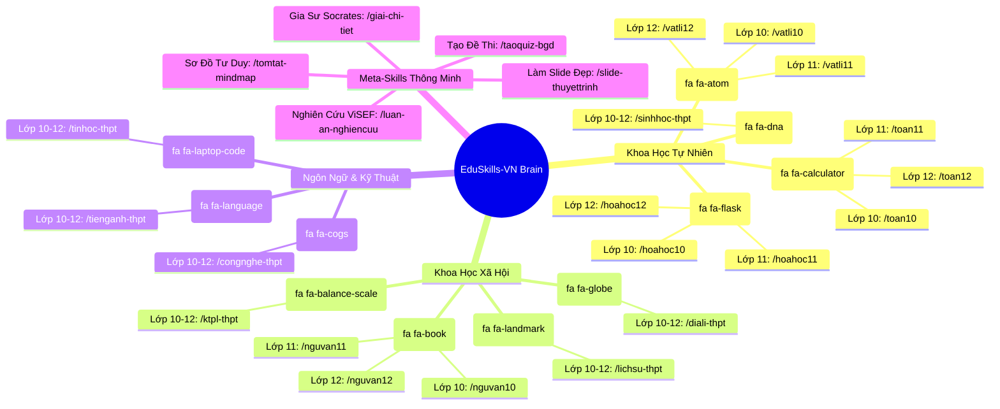

# 🗺️ Ma Trận Danh Mục Kỹ Năng Toàn Diện (Skills Catalog Matrix)

> **Mục tiêu:** Định nghĩa chi tiết hơn 36 kỹ năng chuyên môn hóa bao quát trọn vẹn 3 năm học THPT (Lớp 10, Lớp 11, Lớp 12) cùng các meta-skills học tập thông minh trong hệ sinh thái **EduSkills-VN**.

---

## 1. Bản Đồ Tổng Thể Hệ Sinh Thái Skills



---

## 2. Bảng Đặc Tả Chi Tiết Nhóm Môn Khoa Học Tự Nhiên

### 2.1. Phân Hệ Môn Toán Học
| Lệnh Kích Hoạt | Chuyên Đề Trọng Tâm SGK GDPT 2018 | Quy Chuẩn Đầu Ra | Rào Cản Chống Lỗi (Guardrails) |
| :--- | :--- | :--- | :--- |
| `/toan10` | - Mệnh đề, Tập hợp, Bất phương trình bậc nhất 2 ẩn.<br/>- Hàm số bậc hai, Dấu tam thức bậc hai.<br/>- Hệ thức lượng trong tam giác, Vector & Tọa độ Oxy.<br/>- Thống kê & Xác suất cổ điển. | - Bảng xét dấu tam thức bậc hai.<br/>- Hình vẽ tọa độ Oxy (SVG/TikZ).<br/>- Các bước tìm tập nghiệm rõ ràng. | Cấm nhầm lẫn giữa điều kiện nghiệm có dấu và vô nghiệm ($\Delta < 0$). |
| `/toan11` | - Hàm số lượng giác & Phương trình lượng giác.<br/>- Dãy số, Cấp số cộng, Cấp số nhân.<br/>- Giới hạn dãy số/hàm số, Hàm số liên tục.<br/>- Đạo hàm & Ý nghĩa hình học.<br/>- Quan hệ song song & vuông góc trong không gian. | - Vòng tròn lượng giác minh họa.<br/>- Bảng công thức lượng giác SGK mới.<br/>- Chứng minh hình học không gian chặt chẽ theo tiên đề. | Phải ghi chú điều kiện xác định của hàm số lượng giác ($\tan x, \cot x$). |
| `/toan12` | - Khảo sát và vẽ đồ thị hàm số (Đơn điệu, Cực trị, GTLN-GTNN, Tiệm cận).<br/>- Vector & Hệ trục tọa độ Oxyz trong không gian.<br/>- Nguyên hàm & Tích phân, Ứng dụng tính diện tích, thể tích.<br/>- Xác suất có điều kiện & Công thức Bayes. | - Đồ thị hàm số và bảng biến thiên hoàn chỉnh.<br/>- Phương trình mặt phẳng, đường thẳng Oxyz chuẩn dạng tổng quát/chính tắc. | Bắt buộc kiểm tra tiệm cận đứng qua giới hạn một bên ($\lim_{x \to x_0^+} f(x)$). |

---

### 2.2. Phân Hệ Môn Vật Lí & Hóa Học
| Lệnh Kích Hoạt | Chuyên Đề Trọng Tâm SGK GDPT 2018 | Quy Chuẩn Đầu Ra | Rào Cản Chống Lỗi (Guardrails) |
| :--- | :--- | :--- | :--- |
| `/vatli10-12` | - Lớp 10: Động học, Động lực học, Năng lượng, Động lượng.<br/>- Lớp 11: Dao động điều hòa, Sóng cơ & sóng dừng, Điện trường, Dòng điện.<br/>- Lớp 12: Vật lí nhiệt (Nội năng, Nhiệt dung riêng), Khí lí tưởng (Phương trình Clapeyron - Mendeleev), Từ trường, Vật lí hạt nhân. | - Đồ thị li độ - thời gian, vận tốc - thời gian.<br/>- Đơn vị đo hệ SI chuẩn ($J, N, kg, Pa, K$).<br/>- Diễn giải bản chất vật lí trước khi thế số. | Không dùng $t$ (độ Celsius) trong phương trình trạng thái khí lí tưởng, bắt buộc dùng $T = t + 273$ (Kelvin). |
| `/hoahoc10-12`| - Lớp 10: Cấu hình electron, Bảng tuần hoàn, Liên kết hóa học, Phản ứng oxi hóa - khử.<br/>- Lớp 11: Cân bằng hóa học, Cân bằng ion trong dung dịch, Hợp chất hữu cơ đại cương.<br/>- Lớp 12: Ester - Lipid, Carbohydrate, Amine - Amino acid - Peptide, Kim loại chuyển tiếp, Phức chất. | - Phương trình ion thu gọn.<br/>- Tên gọi 100% IUPAC tiếng Anh.<br/>- Bảng so sánh tính chất vật lí (nhiệt độ sôi, độ tan). | Nghiêm cấm dùng danh pháp cũ (axit fomic, axetilen, rượu etylic). |

---

## 3. Bảng Đặc Tả Chi Tiết Nhóm Môn Khoa Học Xã Hội

| Lệnh Kích Hoạt | Phạm Vi Kiến Thức Chuyên Sâu | Sản Phẩm Đầu Ra Mẫu | Tiêu Chuẩn Sư Phạm Độc Quyền |
| :--- | :--- | :--- | :--- |
| `/nguvan10` | Đọc hiểu Thần thoại, Sử thi, Thơ Đường luật, Truyện truyền kỳ, Văn bản thông tin. | Bảng đối chiếu đặc trưng thể loại (Không gian, Thời gian, Nhân vật, Cốt truyện). | Không phân tích chung chung; bám sát từ ngữ, hình ảnh đặc sắc trong văn bản. |
| `/nguvan11` | Truyện ngắn hiện thực phê phán, Thơ Mới, Kịch bản sân khấu, Tùy bút. | Dàn ý 3 phần (Mở - Thân - Kết) với luận điểm, luận cứ và dẫn chứng lý luận văn học. | Khơi gợi cảm xúc thẩm mỹ cá nhân của học sinh, chống văn mẫu sao chép. |
| `/nguvan12` | Đọc hiểu ngữ liệu NGOÀI SGK; Viết đoạn NLXH 200 chữ; Viết bài NLVH 600 chữ. | Bài viết hoàn chỉnh được chấm thử theo bảng kiểm (Checklist) của Bộ GD&ĐT. | Kiểm soát dung lượng nghiêm ngặt: Đoạn văn 200 chữ không ngắt đoạn, bài văn 600 chữ có đủ 3 phần. |
| `/lichsu-thpt` | Tiến trình lịch sử Việt Nam & Thế giới từ cổ đại đến hiện đại; Các cuộc cải cách lớn. | Trục thời gian (Timeline) kèm phân tích nguyên nhân - diễn biến - kết quả - bài học. | Tránh liệt kê sự kiện khô khan; tập trung tư duy lịch sử, so sánh và đánh giá bối cảnh. |
| `/ktpl-thpt` | Cơ chế thị trường, Lạm phát, Thất nghiệp, Hệ thống chính trị và Pháp luật Việt Nam. | Ma trận giải quyết tình huống pháp lí thực tế; bảng đối chiếu quyền & nghĩa vụ công dân. | Trích dẫn chính xác điều, khoản trong các bộ luật hiện hành (Bộ luật Dân sự, Luật Lao động, Hiến pháp). |

---

## 4. Đặc Tả Nhóm Meta-Skills (Tác Vụ Học Tập Thông Minh)

### 🎯 Skill 1: `/taoquiz-bgd` (Bộ Sinh Đề Thi Chuẩn BGD 2025–2027)
*   **Mục tiêu:** Tạo đề kiểm tra 15 phút, 1 tiết, hoặc đề thi thử tốt nghiệp THPT chuẩn xác theo ma trận 3 phần.
*   **Cú pháp gọi:** `/taoquiz-bgd [môn] [lớp] [chủ_đề] [thời_gian]`
    *   *Ví dụ:* `/taoquiz-bgd toan 12 "Ung dung dao ham" 50phut`
*   **Cấu trúc đầu ra bắt buộc:**
    ```text
    === ĐỀ KIỂM TRA CHUẨN MA TRẬN BỘ GIÁO DỤC (2025-2027) ===
    Môn: Toán 12 | Thời gian: 50 phút
    
    PHẦN I: TRẮC NGHIỆM NHIỀU LỰA CHỌN (12 Câu - 3.0 Điểm)
    Câu 1... [A, B, C, D]
    
    PHẦN II: TRẮC NGHIỆM ĐÚNG / SAI (4 Câu - 4.0 Điểm)
    Câu 1: Cho hàm số y = f(x)...
    a) ... [Đ/S]
    b) ... [Đ/S]
    c) ... [Đ/S]
    d) ... [Đ/S]
    
    PHẦN III: TRẮC NGHIỆM TRẢ LỜI NGẮN (6 Câu - 3.0 Điểm)
    Câu 1: ... Điền đáp số: [____]
    
    === HƯỚNG DẪN CHẤM & BẢNG ĐIỂM CHI TIẾT ===
    (Barem điểm lũy tiến Phần II: 1 ý: 0.1đ | 2 ý: 0.25đ | 3 ý: 0.5đ | 4 ý: 1.0đ)
    ```

---

### 🎨 Skill 2: `/slide-thuyettrinh` (Tạo Slide Thuyết Trình Marp / HTML Cao Cấp)
*   **Mục tiêu:** Biến kiến thức bài học thành các slide thuyết trình tỷ lệ 16:9 với tính thẩm mỹ xuất sắc, sẵn sàng cho học sinh làm việc nhóm hoặc giáo viên trình chiếu.
*   **Cú pháp gọi:** `/slide-thuyettrinh [môn] [bài_học] [số_slide]`
*   **Quy chuẩn thiết kế (Visual Guidelines):**
    *   Không bao giờ sinh slide ngập chữ (Tối đa 6 dòng/slide).
    *   Sử dụng cú pháp **Marp Markdown** hoặc **HTML/Tailwind CSS Standalone**.
    *   Bảng màu cao cấp (Slate Dark, Emerald Indigo, Warm Terracotta), tránh các màu nguyên bản lòe loẹt.
    *   Tích hợp sẵn Mermaid diagram minh họa quy trình hoặc bảng so sánh đối xứng.

---

### 🧠 Skill 3: `/tomtat-mindmap` (Sơ Đồ Tư Duy & Cheatsheet)
*   **Mục tiêu:** Tóm tắt 1 chương hoặc 1 bài học SGK thành sơ đồ tư duy trực quan bằng cú pháp Mermaid.js kèm bảng công thức "nhớ nhanh trong 60 giây".
*   **Cú pháp gọi:** `/tomtat-mindmap [môn] [tên_bài_sgk]`
*   **Sản phẩm đầu ra:**
    1.  Khối code Mermaid mindmap có thể copy trực tiếp vào Notion, Obsidian hoặc xem trực tiếp trên GitHub/Antigravity.
    2.  Bảng 3 cột: *Khái niệm cốt lõi* | *Công thức / Dấu hiệu* | *Ví dụ thực tế*.

---

### 💡 Skill 4: `/giai-chi-tiet` (Gia Sư Khơi Mở Tư Duy Socrates)
*   **Mục tiêu:** Giúp học sinh tự tư duy bài tập thay vì đưa ngay đáp số khiến học sinh ỷ lại.
*   **Cơ chế hoạt động:**
    1.  Học sinh gửi đề bài khó hoặc hình chụp bài tập.
    2.  AI hỏi ngược lại 1 câu hỏi gợi mở then chốt: *"Em nhìn vào phương trình này, biểu thức dưới dấu căn cần có điều kiện gì trước tiên?"*.
    3.  Khi học sinh trả lời, AI khen ngợi và dẫn dắt sang bước biến đổi tiếp theo.
    4.  Cảnh báo rõ các bẫy phổ biến mà 80% học sinh đi thi hay bị mất điểm oan.

---

### 🧪 Skill 5: `/luan-an-nghiencuu` (Hướng Dẫn NCKH Kỹ Thuật THPT ViSEF)
*   **Mục tiêu:** Hỗ trợ học sinh tham gia Cuộc thi Khoa học Kỹ thuật cấp Quốc gia (ViSEF) và các dự án Hoạt động trải nghiệm hướng nghiệp.
*   **Phạm vi trợ giúp:**
    *   Xác định đề tài nghiên cứu phù hợp lứa tuổi và tính khả thi.
    *   Viết tổng quan tình hình nghiên cứu (Literature Review).
    *   Thiết kế bảng khảo sát định lượng / kế hoạch thực nghiệm khoa học.
    *   Biên soạn bài báo cáo và poster thuyết minh chuẩn hội đồng khoa học.
