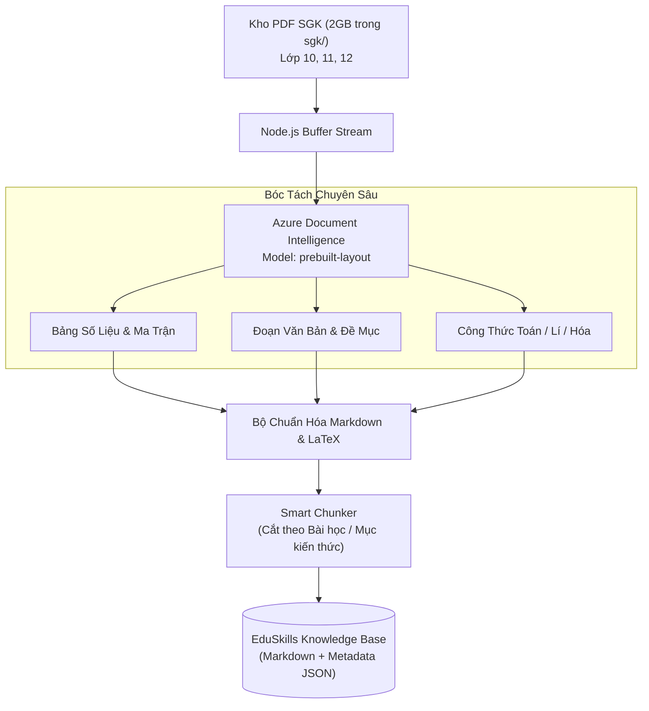

# ⚙️ Pipeline Trích Xuất & Xử Lý Dữ Liệu Sách Giáo Khoa (PDF Extraction Pipeline)

> **Mục tiêu kỹ thuật:** Chuyển hóa hơn 2GB kho sách giáo khoa PDF Lớp 10, 11, 12 hiện có trong thư mục `sgk/` thành kho tri thức có cấu trúc (Structured Knowledge Base), phục vụ trực tiếp cho cơ chế RAG (Retrieval-Augmented Generation) của các Agentic Skills.  
> **Công nghệ chủ đạo:** TypeScript kết hợp Azure AI Document Intelligence REST SDK (`@azure-rest/ai-document-intelligence`).

---

## 1. Thách Thức Đặc Thù Khi Bóc Tách SGK Việt Nam

Tài liệu SGK theo chương trình GDPT 2018 có bố cục cực kỳ phức tạp mà các thư viện OCR thông thường (`pdfplumber`, `PyPDF2`, `Tesseract`) hoàn toàn thất bại:
1.  **Đa cột (Multi-column) & Hộp thông tin (Callout Boxes):** Các mục *"Khởi động"*, *"Khám phá"*, *"Luyện tập"*, *"Vận dụng"*, *"Em có biết"* nằm xen kẽ hai bên lề trang sách.
2.  **Công thức toán học & hóa học phức tạp:** Chứa phân số nhiều tầng, tích phân, căn thức, phương trình phản ứng có điều kiện nhiệt độ/xúc tác.
3.  **Bảng số liệu & Hình vẽ thí nghiệm:** Cần giữ nguyên cấu trúc hàng/cột của bảng thống kê Địa lí, bảng tính chất Vật lí hoặc bảng tuần hoàn Hóa học.



---

## 2. Mã Nguồn Pipeline Bóc Tách SGK Mẫu (TypeScript)

Sử dụng thư viện chính thức `@azure-rest/ai-document-intelligence` theo đúng đặc tả kỹ thuật:

```typescript
import DocumentIntelligence, {
  getLongRunningPoller,
  isUnexpected,
  AnalyzeOperationOutput
} from "@azure-rest/ai-document-intelligence";
import { readFile, writeFile, mkdir } from "node:fs/promises";
import { join, basename } from "node:path";

// 1. Cấu hình Endpoint & API Key từ biến môi trường
const endpoint = process.env.DOCUMENT_INTELLIGENCE_ENDPOINT || "https://your-resource.cognitiveservices.azure.com";
const apiKey = process.env.DOCUMENT_INTELLIGENCE_API_KEY || "your-api-key";

const client = DocumentIntelligence(endpoint, { key: apiKey });

interface ExtractedLesson {
  grade: number;
  subject: string;
  bookTitle: string;
  chapter: string;
  lessonName: string;
  contentMarkdown: string;
  tables: Array<Record<string, any>>;
}

/**
 * Phân tích một file SGK PDF và chuyển đổi sang định dạng Markdown có cấu trúc
 */
export async function extractSgkPdf(pdfPath: string, grade: number, subject: string): Promise<void> {
  console.log(`[Bắt đầu bóc tách] File: ${basename(pdfPath)} (Khối ${grade} - Môn ${subject})`);
  
  const fileBuffer = await readFile(pdfPath);
  const base64Source = fileBuffer.toString("base64");

  // 2. Gửi tác vụ phân tích Layout (giữ nguyên cấu trúc bảng biểu, đầu mục)
  const initialResponse = await client
    .path("/documentModels/{modelId}:analyze", "prebuilt-layout")
    .post({
      contentType: "application/json",
      body: { base64Source },
      queryParameters: {
        locale: "vi-VN",
        outputContentFormat: "markdown" // Tận dụng tính năng xuất Markdown trực tiếp của model 2024+
      }
    });

  if (isUnexpected(initialResponse)) {
    throw new Error(`Lỗi Azure Document Intelligence: ${initialResponse.body.error.message}`);
  }

  // 3. Polling chờ tác vụ hoàn tất
  const poller = getLongRunningPoller(client, initialResponse);
  poller.onProgress((state) => {
    console.log(`Đang xử lý ${basename(pdfPath)}... Trạng thái: ${state.status}`);
  });

  const result = (await poller.pollUntilDone()).body as AnalyzeOperationOutput;
  const analyzeResult = result.analyzeResult;

  if (!analyzeResult) {
    throw new Error("Không nhận được kết quả phân tích từ Azure.");
  }

  console.log(`✅ Phân tích thành công: ${analyzeResult.pages?.length || 0} trang, ${analyzeResult.tables?.length || 0} bảng.`);

  // 4. Tổ chức nội dung xuất ra thư mục knowledge_base
  const outputDir = join("knowledge_base", `lop_${grade}`, subject);
  await mkdir(outputDir, { recursive: true });

  const outputMarkdownFile = join(outputDir, `${basename(pdfPath, ".pdf")}.md`);
  const content = analyzeResult.content || "";

  await writeFile(outputMarkdownFile, content, "utf-8");
  console.log(`💾 Đã lưu tri thức SGK có cấu trúc tại: ${outputMarkdownFile}`);
}
```

---

## 3. Chiến Lược Cắt Phân Đoạn Thông Minh (Smart Chunking Strategy)

Để các Agentic Skills tìm kiếm chính xác bài học khi học sinh hỏi, dữ liệu sau khi OCR từ PDF sẽ được chia nhỏ theo hệ phân cấp 4 tầng:

```text
[TẦNG 1: MÔN HỌC & KHỐI LỚP]
 └── [TẦNG 2: CHƯƠNG / CHỦ ĐỀ] (Ví dụ: Chương 1 - Ứng dụng đạo hàm để khảo sát hàm số)
      └── [TẦNG 3: BÀI HỌC CỤ THỂ] (Ví dụ: Bài 2 - Giá trị lớn nhất và nhỏ nhất của hàm số)
           └── [TẦNG 4: MỤC CHỨC NĂNG]
                ├── # Định nghĩa & Định lí cốt lõi
                ├── # Ví dụ minh họa SGK
                ├── # Hoạt động Luyện tập & Vận dụng
                └── # Bài tập cuối bài
```

### Metadata đính kèm trên mỗi đoạn tri thức (Chunk Metadata):
```json
{
  "book_series": "KetNoiTriThuc",
  "grade": 12,
  "subject": "Toan",
  "chapter_id": 1,
  "chapter_name": "Ứng dụng đạo hàm để khảo sát và vẽ đồ thị của hàm số",
  "lesson_id": 2,
  "lesson_name": "Giá trị lớn nhất và giá trị nhỏ nhất của hàm số",
  "page_start": 12,
  "page_end": 18,
  "yccd": "Tìm được giá trị lớn nhất, nhỏ nhất của hàm số trên một đoạn cho trước bằng đạo hàm.",
  "keywords": ["GTLN", "GTNN", "đạo hàm", "bảng biến thiên", "đoạn [a; b]"]
}
```

---

## 4. Kiểm Soát Chất Lượng Sau Khi Bóc Tách (Data Sanitization)

Mỗi file Markdown trích xuất ra phải chạy qua một script tự động kiểm tra tính toàn vẹn:
1.  **Sửa lỗi ký tự toán học:** Thay thế các ký tự bị OCR nhầm (như `x` thay cho dấu nhân `\times`, dấu trừ `-` thay cho gạch nối, chữ cái lọt vào chỉ số dưới).
2.  **Chuẩn hóa bảng biểu:** Đảm bảo mọi bảng biểu đều có đầy đủ tiêu đề cột và định dạng phân cách Markdown `|---|---|`.
3.  **Gắn thẻ bài tập:** Tự động gắn nhãn `[DE_BAI]`, `[LOI_GIAI_SGK]` cho các câu hỏi luyện tập để làm Few-Shot Data cho các skills.
