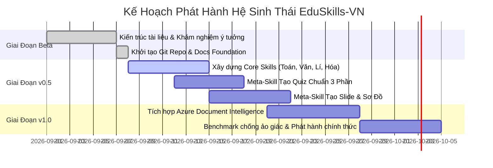

# 📋 Lộ Trình Phát Triển & Bảng Phân Việc (Roadmap & Task Board)

> **Quản lý dự án:** Phân loại công việc theo hệ thống thẻ mã màu trực quan (Color-Coded Priority Tags) và theo từng giai đoạn từ phiên bản thử nghiệm **Beta v0.1** đến **Chính thức v1.0**.

---

## 🎨 1. Hệ Thống Mã Màu Phân Cấp Ưu Tiên (Priority Tags)

| Nhãn Màu | Cấp Độ Ưu Tiên | Định Nghĩa & Tác Động | Thời Gian Giải Quyết |
| :---: | :--- | :--- | :--- |
| 🔴 **`[P0-Core]`** | **Khẩn cấp / Cốt lõi** | Nền tảng sống còn: Kiến trúc docs, quy chuẩn BGD, cơ chế chống ảo giác, barem điểm. | Ngay lập tức |
| 🟡 **`[P1-Feature]`** | **Tính năng chính** | Xây dựng các file `SKILL.md` cho từng môn thi chính (Toán, Văn, Anh, Lí, Hóa, Sinh, Sử, Địa, KTPL). | Giai đoạn 2 |
| 🟢 **`[P2-Tooling]`** | **Công cụ bổ trợ** | Các meta-skills nâng cao: Tạo slide Marp, sinh sơ đồ Mermaid, bóc tách PDF SGK Azure. | Giai đoạn 3 |
| 🟣 **`[P3-Release]`** | **Phân phối & Cộng đồng**| Đóng gói Repo GitHub, hướng dẫn cộng đồng, tài liệu tích hợp Cursor / Antigravity / Claude. | Giai đoạn 4 |

---

## 🗺️ 2. Bảng Phân Việc Chi Tiết (Active Task Board)

### 🔴 Giai Đoạn 1: Thiết Lập Nền Tảng & Đặc Tả Kỹ Thuật (Phase 1: Foundations)
- [x] 🔴 **`[P0-Core]`** Khám nghiệm ý tưởng chuyên sâu theo `/idea-autopsy` ([`01_IDEA_AUTOPSY_AND_VALIDATION.md`](01_IDEA_AUTOPSY_AND_VALIDATION.md)).
- [x] 🔴 **`[P0-Core]`** Bản đặc tả kiến trúc Agentic Skills chuẩn AAS Core ([`02_ARCHITECTURE_AGENTIC_SKILLS.md`](02_ARCHITECTURE_AGENTIC_SKILLS.md)).
- [x] 🔴 **`[P0-Core]`** Chuẩn hóa quy định GDPT 2018 & ma trận đề thi BGD 2025-2027 ([`03_CURRICULUM_BGD_2026_STANDARDS.md`](03_CURRICULUM_BGD_2026_STANDARDS.md)).
- [x] 🔴 **`[P0-Core]`** Ma trận danh mục 36+ skills toàn diện ([`04_SKILLS_CATALOG_MATRIX.md`](04_SKILLS_CATALOG_MATRIX.md)).
- [x] 🔴 **`[P0-Core]`** Thiết kế pipeline trích xuất kho SGK 2GB với Azure AI Document Intelligence ([`05_PDF_EXTRACTION_PIPELINE.md`](05_PDF_EXTRACTION_PIPELINE.md)).
- [x] 🔴 **`[P0-Core]`** Thiết lập bộ khung kiểm thử và benchmark chất lượng ([`06_TESTING_AND_BENCHMARK_FRAMEWORK.md`](06_TESTING_AND_BENCHMARK_FRAMEWORK.md)).
- [x] 🔴 **`[P0-Core]`** Xây dựng bảng phân việc và lộ trình phát triển ([`07_ROADMAP_AND_TASK_BOARD.md`](07_ROADMAP_AND_TASK_BOARD.md)).
- [x] 🔴 **`[P0-Core]`** Cập nhật trang chủ tổng quan [`readme.md`](../readme.md).

---

### 🟡 Giai Đoạn 2: Xây Dựng Các Playbooks Kỹ Năng Cốt Lõi (Phase 2: Core Skills Playbooks)
- [ ] 🟡 **`[P1-Feature]`** Xây dựng file `skills/toan-thpt/SKILL.md`: Chuyên sâu lớp 10, 11, 12, giải tích, hình học không gian, xác suất Bayes.
- [ ] 🟡 **`[P1-Feature]`** Xây dựng file `skills/ngu-van-thpt/SKILL.md`: Khung đọc hiểu ngữ liệu ngoài SGK, dàn ý NLXH 200 chữ và NLVH 600 chữ.
- [ ] 🟡 **`[P1-Feature]`** Xây dựng file `skills/hoa-hoc-thpt/SKILL.md`: Chuẩn hóa 100% danh pháp IUPAC tiếng Anh, bài toán bảo toàn electron và phức chất.
- [ ] 🟡 **`[P1-Feature]`** Xây dựng file `skills/vat-li-thpt/SKILL.md`: Động học, dao động cơ, vật lí nhiệt và khí lí tưởng theo SGK mới.
- [ ] 🟡 **`[P1-Feature]`** Xây dựng file `skills/sinh-hoc-thpt/SKILL.md`: Di truyền học phân tử, phả hệ và quy luật di truyền Men-đen.
- [ ] 🟡 **`[P1-Feature]`** Xây dựng file `skills/tieng-anh-thpt/SKILL.md`: Ngữ pháp trọng điểm, đọc hiểu theo ma trận BGD và IELTS format.

---

### 🟢 Giai Đoạn 3: Meta-Skills & Công Cụ Tác Vụ Thông Minh (Phase 3: Meta-Tools)
- [ ] 🟢 **`[P2-Tooling]`** Xây dựng file `skills/tao-quiz-bgd/SKILL.md`: Tự động sinh đề kiểm tra 15p, 45p và đề thi tốt nghiệp THPT đủ 3 phần (Phần I, II Đúng/Sai lũy tiến, III Trả lời ngắn).
- [ ] 🟢 **`[P2-Tooling]`** Xây dựng file `skills/slide-thuyet-trinh/SKILL.md`: Template Marp Markdown và HTML Glassmorphism tỷ lệ 16:9 thẩm mỹ cao.
- [ ] 🟢 **`[P2-Tooling]`** Xây dựng file `skills/tomtat-mindmap/SKILL.md`: Công cụ sinh sơ đồ tư duy Mermaid.js và bảng cheatsheet 60 giây.
- [ ] 🟢 **`[P2-Tooling]`** Xây dựng file `skills/giai-chi-tiet/SKILL.md`: Trợ giảng khơi mở tư duy theo phương pháp Socrates, không làm bài hộ.
- [ ] 🟢 **`[P2-Tooling]`** Xây dựng file `skills/luan-an-nghiencuu/SKILL.md`: Hướng dẫn NCKH kỹ thuật học sinh THPT ViSEF.

---

### 🟣 Giai Đoạn 4: Trích Xuất Dữ Liệu Thực Tế & Phát Hành (Phase 4: Extraction & Release)
- [ ] 🟣 **`[P3-Release]`** Cấu hình script TypeScript chạy Azure AI Document Intelligence trích xuất các bài học trọng điểm từ `sgk/`.
- [ ] 🟣 **`[P3-Release]`** Đồng bộ kho mã nguồn lên GitHub tại remote: `git@github.com:Wothing0406/EduSkills-VN.git` (hoặc HTTPS).
- [ ] 🟣 **`[P3-Release]`** Viết tài liệu tích hợp 1-click cho Antigravity IDE, Claude Code và Cursor.
- [ ] 🟣 **`[P3-Release]`** Mở cổng tiếp nhận đóng góp (Contribution Guidelines) từ cộng đồng giáo viên và học sinh THPT.

---

## 📅 3. Lịch Trình Phát Hành Các Phiên Bản (Release Milestones)

