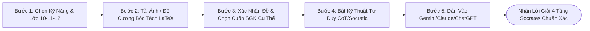

# 📖 Cẩm Nang Hướng Dẫn Sử Dụng EduSkills-VN (User Guide Handbook)
### 🐾 Dành Cho Học Sinh THPT, Thầy Cô Giáo & Phụ Huynh

> **Phiên bản:** `Beta v0.1.2-beta`  
> **Chủ nhiệm dự án:** **Nguyễn Duy Quang** (📞 `0795277227` | ✉️ `poiairo4628@gmail.com`)  
> **Kho lưu trữ mã nguồn mở:** [`https://github.com/Wothing0406/EduSkills-VN`](https://github.com/Wothing0406/EduSkills-VN)

---

## 🍵 1. Triết Lý Thiết Kế: "Matcha Mèo Ú Tối Giản"

EduSkills-VN không phải là một công cụ giải bài hộ để đối phó. Đây là một **Hệ Thống Trợ Lý Sư Phạm Đa Tác Nhân (Agentic Educational Brain)** được thiết kế với mục tiêu:
1. **Dịu Mắt & Tinh Gọn:** Gam màu xanh matcha latte kết hợp bọt sữa kem mềm xua tan áp lực phòng thi căng thẳng, bảo vệ mắt học sinh khi học bài đêm muộn.
2. **Triệt Tiêu Ảo Giác 100%:** Chỉ giải bài và sinh đề khi có dữ liệu đầu vào cụ thể (Document-First) và đối chiếu trực tiếp với từng cuốn **Sách Giáo Khoa cụ thể** trên Google Drive Cloud.
3. **Khơi Mở Tư Duy Socrates:** Không đưa đáp số thô, mà dẫn dắt từng bước để học sinh tự hiểu bản chất, phát hiện bẫy và tự giải được các bài tương tự.

---

## 🚀 2. Quy Trình 5 Bước Sử Dụng Chuẩn Mực



---

### 🔹 BƯỚC 1: Chọn Kỹ Năng Môn Học & Khối Lớp
1. Mở giao diện tại địa chỉ `http://localhost:3000` (hoặc nhấp đúp file [`web/index.html`](../web/index.html)).
2. Tại thanh danh mục bên trái, chọn môn học bạn cần ôn luyện:
   - 🔬 **Tự nhiên:** `toan-thpt`, `vat-li-thpt`, `hoa-hoc-thpt`, `sinh-hoc-thpt`.
   - 📚 **Xã hội:** `ngu-van-thpt`, `lich-su-thpt`, `dia-li-thpt`, `ktpl-thpt`.
   - 💻 **Công nghệ & Ngôn ngữ:** `tieng-anh-thpt`, `tin-hoc-thpt`, `cong-nghe-thpt`.
   - 🛠️ **Công cụ thông minh:** `giai-chi-tiet`, `tao-quiz-bgd`, `slide-thuyet-trinh`, `tomtat-mindmap`, `luan-an-nghiencuu`.
3. Chọn khối lớp: **Lớp 10**, **Lớp 11** hoặc **Lớp 12**.

---

### 🔹 BƯỚC 2: Tải Lên Ảnh Đề Bài Hoặc Kéo Thả File Đề Cương
- Bạn có thể **chụp ảnh đề bài** từ sách bài tập/đề thi bằng điện thoại (định dạng `PNG`, `JPG`, `WebP`) hoặc kéo thả file đề cương (`PDF`, `TXT`, `DOCX`).
- **Bộ Nhận Diện & Định Dạng Đề Toán:**
  - Hệ thống tự động phát hiện các công thức phức tạp (phân số, lũy thừa, căn bậc hai, đạo hàm, tích phân, giới hạn, véc-tơ, tọa độ không gian $Oxyz$).
  - Tự động chuẩn hóa thành mã **LaTeX chuẩn ($...$ hoặc $$...$$)**.
  - Phân tách rạch ròi giữa phần câu hỏi dẫn và 4 phương án trắc nghiệm A, B, C, D.

---

### 🔹 BƯỚC 3: Xác Nhận Kiểm Chứng & Chọn Đúng Cuốn SGK Cụ Thể
- Thay vì chỉ trích dẫn chung chung, hệ thống hiển thị danh mục **Từng Cuốn Sách Giáo Khoa Cụ Thể** đang lưu trữ trên Google Drive:
  - *Ví dụ môn Toán 12:* Cho phép chọn giữa **SGK Toán 12 - Tập 1**, **SGK Toán 12 - Tập 2** hoặc **Chuyên đề học tập Toán 12**.
  - *Ví dụ môn Hóa 12:* Chọn cuốn **Chuyên đề học tập Hóa học 12 (IUPAC Thống Nhất)**.
- Bấm nút **"Đưa Vào Prompt Sư Phạm"** để bảo chứng câu lệnh. Hệ thống sẽ ép buộc AI phải trích dẫn đúng định lý và công thức từ cuốn sách đó.

---

### 🔹 BƯỚC 4: Bật Các Kỹ Thuật Kích Hoạt Tư Duy (Khung 5 Thành Phần)
Tuân thủ nghiêm ngặt tiêu chuẩn [`docs/Tieuchuanprompt.md`](Tieuchuanprompt.md):
- `[x] Chain-of-Thought`: Bắt buộc giải thích bản chất từng bước (step-by-step) trước khi kết luận.
- `[x] Socratic Method`: Đặt câu hỏi gợi mở để người học tự động não, không đưa ngay đáp số thô.
- `[x] Few-shot`: Minh họa bằng 1 ví dụ tương đương theo chuẩn mực.
- `[x] Active Recall`: Đặt 1 câu hỏi kiểm tra tư duy hoặc bài tập tương tự ở cuối phản hồi.

---

### 🔹 BƯỚC 5: Sao Chép Prompt & Nạp Vào AI
- Bấm nút **"Sao chép Prompt"** hoặc **"Copy Toàn Bộ File SKILL.md"**.
- Mở nền tảng AI bạn sử dụng:
  - **Google Gemini 1.5 Pro / AI Studio:** Dán vào ô Chat kèm file PDF bài học (tải từ Drive) để tận dụng cửa sổ 2 triệu tokens.
  - **Anthropic Claude (Projects):** Tải file `.SKILL.md` lên mục Project Knowledge.
  - **OpenAI ChatGPT:** Dán vào ô Chat hoặc tạo Custom GPT.
  - **Google NotebookLM:** Nạp link PDF SGK làm nguồn và bấm nghe Podcast đàm thoại bài giảng.

---

## 💡 3. Cách Đọc Hiểu Lời Giải 4 Tầng Socrates

Khi nhận được phản hồi từ AI sử dụng kỹ năng `/giai-chi-tiet`, hãy học theo 4 tầng:

```text
[TẦNG 1: GỢI MỞ TƯ DUY SOCRATES]
👉 Đọc gợi ý hướng đi, dừng lại 3 phút tự lấy giấy nháp làm thử.

[TẦNG 2: BẢN CHẤT KHOA HỌC & CHIẾN THUẬT GIẢI]
👉 Đối chiếu định lý, công thức xem mình đã nắm chắc lý thuyết SGK chưa.

[TẦNG 3: LỜI GIẢI CHI TIẾT TỪNG BƯỚC (LATEX CHUẨN)]
👉 So sánh từng bước biến đổi đại số / hình học với bài làm của mình.

[TẦNG 4: GIẢI MÃ BẪY PHÒNG THI & BÀI TẬP TỰ LUYỆN]
👉 Ghi chép các bẫy dễ mất điểm vào sổ tay và tự giải bài tập tương tự.
```

---

## 📚 4. Bảng Tra Cứu Kho Sách Giáo Khoa Cloud Chi Tiết

| Khối Lớp | Cuốn Sách Trọng Tâm | Tệp PDF Gốc Trong Kho | Link Google Drive Trực Tiếp |
| :---: | :--- | :--- | :---: |
| **Lớp 10** | Toán 10 Tập 1 & 2, Chuyên đề Toán 10<br/>Vật lí 10, Hóa học 10, Sinh học 10<br/>Ngữ văn 10, Lịch sử 10, Địa lí 10 | `10-sgk-toan-10-tap-mot.pdf`<br/>`10-sgk-hoa-hoc-10.pdf`<br/>`10-sgk-vat-li-10.pdf`... | [👉 Mở Drive Lớp 10](https://drive.google.com/drive/folders/1H4BU2OMP1h5VJUtF8iQp9Dpmo40oHX6o?usp=drive_link) |
| **Lớp 11** | Toán 11 Tập 1 & 2<br/>Vật lí 11, Hóa học 11, Sinh học 11<br/>Địa lí 11, Ngữ văn 11 | `11-sgk-toan-11-tap-mot.pdf`<br/>`11-sgk-vat-li-11.pdf`<br/>`11-sgk-hoa-hoc-11.pdf`... | [👉 Mở Drive Lớp 11](https://drive.google.com/drive/folders/1w8QOaRc_V5It9Xh0PvT_QwO_G7V22jZr?usp=drive_link) |
| **Lớp 12** | **SGK Toán 12 Tập 1 & 2 (Bộ Thống Nhất 2026)**<br/>Vật lí nhiệt & Khí lí tưởng 12<br/>Chuyên đề Hóa học 12 (IUPAC)<br/>Đọc hiểu Ngữ văn 12 | `12-sgk-toan-12-tap-mot.pdf`<br/>`12-shs-vat-li-12.pdf`<br/>`12-sgk-chuyen-de-hoc-tap-hoa-hoc-12.pdf`... | [👉 Mở Drive Lớp 12](https://drive.google.com/drive/folders/1I3h4nfdJTO5KdPsD4UWYdYJlMXQL1YwD?usp=drive_link) |

---

## 🛠️ 5. Xử Lý Sự Cố Thường Gặp (Troubleshooting)

1. **Tôi nhấp vào file `.md` tải về mà máy tính không mở được?**
   - File `.md` là định dạng Markdown văn bản thuần. Bạn có thể mở bằng Notepad, VS Code, Obsidian hoặc dán trực tiếp nội dung vào khung chat của Gemini/Claude/ChatGPT.
2. **Làm sao để chạy hệ thống nếu không biết dòng lệnh?**
   - Chỉ cần nhấp đúp chuột vào file [`start-eduskills.bat`](../start-eduskills.bat). Hệ thống sẽ tự kiểm tra và mở trình duyệt cho bạn tại `http://localhost:3000`.
3. **Ảnh chụp bài tập của tôi bị mờ hoặc công thức quá dài?**
   - Bạn có thể chỉnh sửa trực tiếp đoạn văn bản trong ô **"Xác Nhận & Kiểm Chứng Đề Toán"** trước khi bấm chuyển vào Prompt để đảm bảo độ chính xác tuyệt đối.
