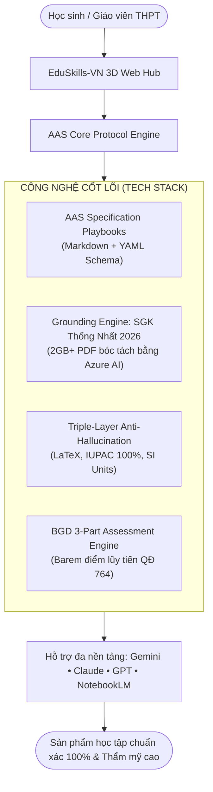

# 🎓 EduSkills-VN: The Agentic AI Brain for Vietnamese High School Education
### 🇻🇳 Hệ Sinh Thái Agentic AI Skills THPT Chuẩn Bộ Giáo Dục & Đào Tạo 2026–2027

> **Phiên bản:** `Beta v0.1-beta`  
> **Kiến trúc tiêu chuẩn:** AAS Core Specification ([`sickn33/agentic-awesome-skills`](https://github.com/sickn33/agentic-awesome-skills))  
> **Chuẩn dữ liệu:** Bộ Sách Giáo Khoa Thống Nhất Toàn Quốc từ năm 2026 (Lớp 10, 11, 12) & Định dạng Đề thi Tốt nghiệp THPT 2025–2027 (Quyết định 764/QĐ-BGDĐT).  
> **Tác giả & Chủ nhiệm dự án:** **Nguyễn Duy Quang** (📞 `0795277227` | ✉️ `poiairo4628@gmail.com`)

---

[](#)
[](https://moet.gov.vn)
[](https://moet.gov.vn)
[](#-hướng-dẫn-nạp-bộ-não-vào-các-ai)
[](web/index.html)
[](https://github.com/sickn33/agentic-awesome-skills)
[](https://opensource.org/licenses/MIT)

---

## ⚡ 1. Tech Stack Flexing: Công Nghệ Cốt Lõi Tạo Nên Sự Khác Biệt

EduSkills-VN không phải là một tập hợp các câu prompt tùy tiện. Đây là một **Hệ Thống Kỹ Nghệ Kỹ Năng Tác Nhân (Agentic Skills Engineering System)** giải quyết triệt để vấn đề "AI đưa ra kết quả xàm, công thức sai, quiz lệch chuẩn, slide xấu":



1.  **Tiêu chuẩn AAS Core (Agentic Awesome Skills):** Cấu trúc cẩm nang `SKILL.md` độc lập, an toàn tuyệt đối (không chứa binary thực thi độc hại), dễ dàng nạp làm Plugin cho mọi AI Agent.
2.  **Bộ SGK Thống Nhất Toàn Quốc 2026:** Toàn bộ tri thức bám sát tuyệt đối bộ SGK chuẩn mới nhất của Bộ GD&ĐT (được bóc tách từ hơn 2GB kho PDF SGK Lớp 10, 11, 12 có sẵn trong thư mục `sgk/`).
3.  **Quy trình tạo Quiz "Document-First" (`/taoquiz-bgd`):** Bắt buộc học sinh cung cấp bài học/tài liệu trước $\to$ AI phân tích và thiết kế đề thi **ĐỘ KHÓ CAO** (Vận dụng & Vận dụng cao), gài bẫy tư duy kinh điển, đủ 3 phần thi và barem điểm lũy tiến Đúng/Sai (0.1đ - 0.25đ - 0.5đ - 1.0đ).
4.  **Danh pháp Hóa học 100% IUPAC tiếng Anh:** *Sodium, Copper, Sulfuric acid, Ethanoic acid, Glucose* theo đúng SGK mới.
5.  **3D Web Experience (Three.js & WebGL):** Ứng dụng Web 3D không gian tương tác trực quan tại [`web/index.html`](web/index.html) để khám phá kỹ năng và sao chép prompt chuẩn hóa 1-click.

---

## 🌐 2. Trải Nghiệm Giao Diện 3D Web (3D Web Hub)

Ứng dụng web được thiết kế riêng mang đậm bản sắc học sinh Việt Nam (tinh thần hiếu học, thanh lịch, giao diện trực quan):
*   **Vũ trụ 3D:** Khối cầu trung tâm *"EduSkills Brain"* và 4 vành đai quỹ đạo mang mã màu riêng cho 4 phân hệ kỹ năng.
*   **Kho Prompt Chuẩn Hóa:** Cho phép tra cứu, tìm kiếm, lọc theo phân hệ, và copy Prompt Payload chuẩn hóa cho mọi mô hình.
*   **Cách khởi chạy ngay:** Chạy lệnh trong PowerShell:
    ```powershell
    start web/index.html
    ```

---

## 🧩 3. Hướng Dẫn Nạp "Bộ Não" Vào Các AI (Không Cần Chuyên Sâu)

Bạn không cần biết lập trình. Chỉ cần làm theo hướng dẫn cực kỳ đơn giản dưới đây:

### 🔵 1. Nạp Vào Google Gemini (Web / AI Studio)
1. Mở [Google AI Studio](https://aistudio.google.com/) hoặc Gemini Web.
2. Tại ô **System Instructions**, sao chép và dán nội dung file `SKILL.md` (ví dụ `skills/meta-tools/tao-quiz-bgd/SKILL.md`).
3. Đính kèm file PDF SGK từ thư mục `sgk/` vào cửa sổ chat. Nhờ Context 2M tokens của Gemini, AI sẽ đọc hiểu trọn vẹn cả cuốn sách!

### 🟣 2. Nạp Vào Anthropic Claude (Projects / Claude Code)
1. Mở [Claude.ai](https://claude.ai/) $\to$ Tạo một **Project** mới đặt tên là *"EduSkills-VN THPT"*.
2. Tải các file `SKILL.md` trong thư mục `skills/` vào mục **Project Knowledge**.
3. Trong phần **Project Instructions**, nhập: *"Bạn là Chuyên gia sư phạm EduSkills-VN, luôn giải bài từng bước và ra đề chuẩn BGD 2026"*.

### 🟢 3. Nạp Vào OpenAI ChatGPT (Custom GPTs)
1. Truy cập ChatGPT Plus $\to$ Chọn **Explore GPTs** $\to$ Bấm **Create a GPT**.
2. Ở tab **Configure**, dán toàn bộ nội dung file `SKILL.md` vào ô **Instructions**.
3. Bật tính năng **Code Interpreter** để AI hỗ trợ vẽ đồ thị hàm số và tính toán số học chuẩn xác.

### 🟠 4. Nạp Vào Google NotebookLM (Tạo Podcast & Gia Sư Ảo)
1. Truy cập [notebooklm.google.com](https://notebooklm.google.com/) $\to$ Tạo Notebook mới.
2. Tải file PDF bài học trong thư mục `sgk/` lên làm nguồn tài liệu (Source).
3. Bấm **Audio Overview** để AI tự động tạo buổi Podcast đàm thoại bài giảng cực kỳ hấp dẫn, không lo bị ảo giác!

---

## 📂 4. Bản Đồ Phân Hệ Kỹ Năng (`skills/`)

```text
skills/
├── khoa-hoc-tu-nhien/         # 🔬 Môn Khoa Học Tự Nhiên
│   ├── toan-thpt/SKILL.md     # /toan10-12: Giải tích 10-12, Hình Oxyz, Xác suất Bayes
│   ├── vat-li-thpt/SKILL.md   # /vatli10-12: Dao động, Sóng, Vật lí nhiệt (Kelvin), Khí lí tưởng
│   ├── hoa-hoc-thpt/SKILL.md  # /hoahoc10-12: 100% IUPAC tiếng Anh, bảo toàn e, phức chất
│   └── sinh-hoc-thpt/SKILL.md # /sinhhoc-thpt: Di truyền phân tử, sơ đồ phả hệ
├── khoa-hoc-xa-hoi/          # 📚 Môn Khoa Học Xã Hội
│   ├── ngu-van-thpt/SKILL.md  # /nguvan10-12: Đọc hiểu ngoài SGK (4đ), NLXH 200 chữ, NLVH (4đ)
│   ├── lich-su-thpt/SKILL.md  # /lichsu-thpt: Trục thời gian (Timeline), phân tích nguyên nhân
│   ├── dia-li-thpt/SKILL.md   # /diali-thpt: Số liệu, biểu đồ kinh tế và Atlat Địa lí VN
│   └── ktpl-thpt/SKILL.md     # /ktpl-thpt: Cơ chế thị trường, Lạm phát, tình huống pháp lý
├── ngon-ngu-cong-nghe/       # 💻 Ngôn Ngữ & Kỹ Thuật
│   ├── tieng-anh-thpt/SKILL.md# /tienganh-thpt: Ngữ pháp trọng điểm, phiên âm IPA, đọc hiểu
│   ├── tin-hoc-thpt/SKILL.md  # /tinhoc-thpt: Lập trình Python, CSDL quan hệ SQL, mạng máy tính
│   └── cong-nghe-thpt/SKILL.md# /congnghe-thpt: Mạch điện 3 pha, vi điều khiển, nông nghiệp CNC
└── meta-tools/               # 🛠️ Công Cụ Học Tập Thông Minh
    ├── tao-quiz-bgd/SKILL.md  # /taoquiz-bgd: Tạo đề thi 3 phần độ khó cao (Document-First)
    ├── slide-thuyet-trinh/SKILL.md # /slide-thuyettrinh: Slide Marp / HTML 16:9 chuẩn visual
    ├── tomtat-mindmap/SKILL.md# /tomtat-mindmap: Sơ đồ tư duy Mermaid.js & Cheatsheet 60s
    ├── giai-chi-tiet/SKILL.md # /giai-chi-tiet: Gia sư khơi mở tư duy Socrates
    └── luan-an-nghiencuu/SKILL.md # /luan-an-nghiencuu: Hướng dẫn NCKH kỹ thuật ViSEF
```

---

## 🎯 5. Thực Hành Meta-Skill `/taoquiz-bgd` (Document-First)

Khi sử dụng kỹ năng tạo đề thi, hãy gửi kèm tài liệu theo mẫu:

```text
/taoquiz-bgd
[TÀI LIỆU ĐÍNH KÈM]:
"Bài 2: Phương trình trạng thái khí lí tưởng pV/T = const... Ở điều kiện chuẩn, 1 mol khí chiếm thể tích 22.4 lít..."

Yêu cầu: Tạo đề kiểm tra 15 phút độ khó cao, có câu hỏi phân hóa về đồ thị đẳng tích và bẫy đổi đơn vị áp suất từ mmHg sang Pa.
```

---

## 🚀 6. Hướng Dẫn Cài Đặt & Chạy Cục Bộ (Quick Installation)

Dành cho học sinh, giáo viên hoặc lập trình viên muốn tải và trải nghiệm hệ thống:

```bash
# 1. Clone kho lưu trữ mã nguồn mở về máy
git clone https://github.com/Wothing0406/EduSkills-VN.git
cd EduSkills-VN

# 2. Khởi chạy hệ thống 1-click (Dành cho người dùng Windows)
start-eduskills.bat

# Hoặc chạy trực tiếp bằng Node.js:
node server.js
```
Hệ thống sẽ tự động kiểm định 100% dataset kỹ năng và mở giao diện Web Hub 3D tại: `http://localhost:3000`.

---

## 📞 7. Liên Hệ & Đóng Góp (Author & Community)

Mọi ý kiến đóng góp, đề xuất thêm kỹ năng hoặc thắc mắc vui lòng liên hệ:
*   **Chủ nhiệm dự án:** **Nguyễn Duy Quang**
*   **Số điện thoại / Zalo:** **`0795277227`**
*   **Email:** **`poiairo4628@gmail.com`**
*   **GitHub Repository:** [https://github.com/Wothing0406/EduSkills-VN](https://github.com/Wothing0406/EduSkills-VN)

Dự án phát hành dưới giấy phép mã nguồn mở **MIT License**. Chung tay vì một nền giáo dục số chất lượng cao cho thế hệ trẻ Việt Nam!