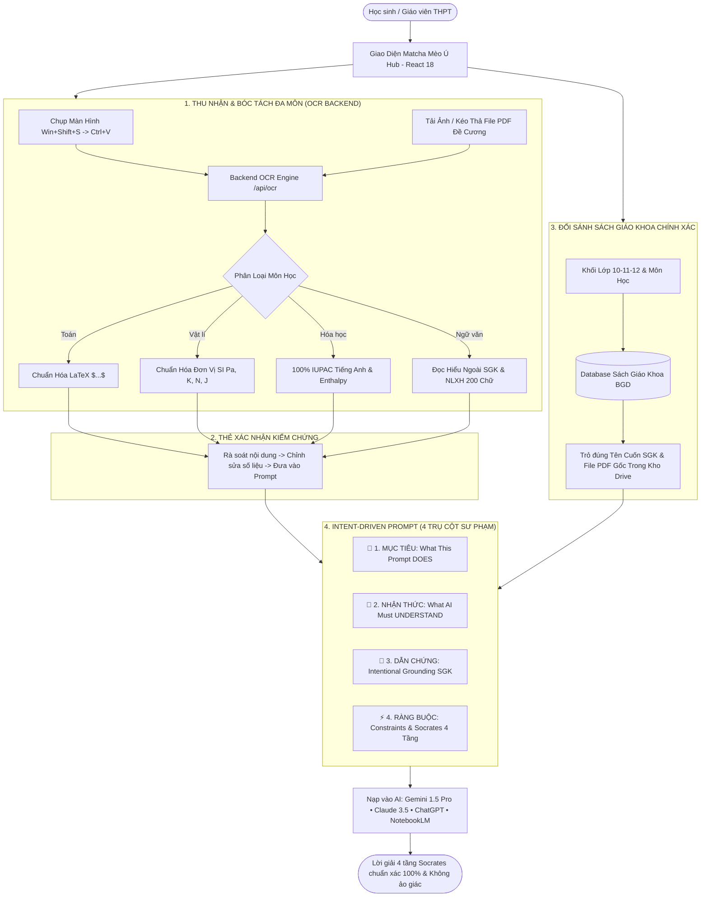

# 🍵 EduSkills-VN: The Agentic AI Brain for Vietnamese High School Education
### 🇻🇳 Hệ Sinh Thái Agentic AI Skills THPT Chuẩn Bộ Giáo Dục & Đào Tạo 2026–2027

> **Phiên bản:** `Beta v0.1.2-beta`  
> **Giao diện cốt lõi:** Matcha Mèo Ú Tối Giản (Cozy Minimalist Cat & Matcha Workspace - React 18)  
> **Backend OCR & Orchestrator:** Node.js Server (`http://localhost:3000`) tích hợp Multi-Domain Parser Engine  
> **Tiêu chuẩn thiết kế Prompt:** Khung Mục Tiêu - Nhận Thức - Dẫn Chứng Có Chủ Đích ([`docs/Tieuchuanprompt.md`](docs/Tieuchuanprompt.md))  
> **Chuẩn dữ liệu:** Bộ Sách Giáo Khoa Thống Nhất Toàn Quốc từ năm 2026 (Lớp 10, 11, 12) & Định dạng Đề thi Tốt nghiệp THPT 2025–2027 (Quyết định 764/QĐ-BGDĐT).  
> **Tác giả & Chủ nhiệm dự án:** **Nguyễn Duy Quang** (📞 `0795277227` | ✉️ `poiairo4628@gmail.com`)

---

[](#)
[](#)
[](#)
[](#)
[](docs/Tieuchuanprompt.md)
[](#-3-tủ-sách-sgk-điện-tử-cloud--đối-sánh-chính-xác-từng-file-pdf)
[](docs/08_USER_GUIDE_HUONG_DAN_SU_DUNG.md)
[](https://opensource.org/licenses/MIT)

---

## 🍵 1. Bản Sắc Riêng: Triết Lý "Matcha Mèo Ú Tối Giản"

Thay vì các giao diện 3D rườm rà làm quạt máy tính kêu to và gây xao nhãng khi học tập, **EduSkills-VN** định hình một bản sắc hoàn toàn riêng biệt:
- 🐱 **Linh vật Mèo Ú Thưởng Trà:** Biểu tượng của sự kiên nhẫn, điềm tĩnh và thông tuệ, xua tan áp lực thi cử căng thẳng.
- 🍵 **Tone màu Matcha Latte & Bọt Sữa:** Gam màu xanh trà matcha dịu mắt (`#385E47`, `#588B69`), nền kem sữa thanh lịch (`#F7F9F6`), bảo vệ thị lực tối đa cho học sinh khi tự học đêm muộn.
- ⚡ **Nền tảng React 18 & OCR Backend:** Khởi chạy tức thì qua Node.js (`server.js`), hỗ trợ dán ảnh bài tập trực tiếp từ clipboard (`Ctrl + V`), kéo thả tài liệu PDF và bóc tách dữ liệu theo môn học chuyên biệt.



---

## 📸 2. OCR Backend & Tính Năng Chụp Màn Hình Dán Trực Tiếp (`Ctrl + V`)

Không còn phải lưu ảnh về máy tính rồi mới tải lên, EduSkills-VN tối ưu hóa trải nghiệm học tập với tốc độ vượt trội:

1. **Dán ảnh chụp màn hình tức thì (`Ctrl + V`):**
   - Học sinh chỉ cần dùng phím tắt `Win + Shift + S` (Windows) hoặc `Cmd + Shift + 4` (macOS) để chụp đề bài bài tập trên màn hình.
   - Nhấn **`Ctrl + V`** bất kỳ đâu trên trang web để dán ảnh trực tiếp từ clipboard vào hệ thống.
2. **Hỗ trợ đa định dạng tài liệu:**
   - Kéo thả hoặc chọn tệp ảnh: `.png`, `.jpg`, `.jpeg`, `.webp`.
   - Tải tệp đề cương/đề thi: `.pdf` (tự động đọc bằng `pdf-parse`), `.docx`, `.txt`, `.md`.
3. **Bóc tách chuyên sâu theo 4 môn học trọng tâm:**
   - 📐 **Toán học:** Chuyển đổi phân số `\frac`, căn thức `\sqrt`, số mũ, tích phân, giới hạn sang mã **LaTeX ($...$)**.
   - ⚡ **Vật lí:** Tự động chuẩn hóa đơn vị đo hệ SI ($Pa, N, J, K, m/s^2$) và chu trình biến đổi nhiệt.
   - 🧪 **Hóa học:** Tự động chuyển 100% danh pháp tiếng Việt cũ sang danh pháp **IUPAC tiếng Anh chuẩn SGK mới** (copper(II) sulfate, sulfuric acid, ethanoic acid...) và định dạng biến thiên Enthalpy $\Delta_r H^0_{298}$.
   - 📖 **Ngữ văn:** Tự động cấu trúc phần **Đọc hiểu văn bản ngoài SGK** (ngữ liệu thơ/truyện) + Hệ thống câu hỏi + Đoạn văn nghị luận 200 chữ theo barem 4đ đọc hiểu + 6đ viết của Bộ GD&ĐT.
4. **Thẻ Xác Nhận Kiểm Chứng Đa Môn:**
   - Hiển thị ảnh thu nhỏ, tên nguồn file và huy hiệu phân loại môn học.
   - Cho phép học sinh rà soát, chỉnh sửa công thức trực tiếp trước khi bấm **"✅ Chèn Vào Trình Ghép Prompt"**.

---

## 📚 3. Tủ Sách SGK Điện Tử Cloud & Đối Sánh Chính Xác Từng File PDF

> [!IMPORTANT]  
> **Loại bỏ hoàn toàn link Drive chung chung:** Hệ thống lập chỉ mục chi tiết từng đầu sách giáo khoa chính khóa của Bộ GD&ĐT trong kho dữ liệu **> 2.03GB** tại [`dataset/books-database.json`](dataset/books-database.json).

Khi người học chọn môn và khối lớp, hệ thống tự động trích xuất:
- **Tên sách giáo khoa cụ thể:** (Ví dụ: *SGK Toán 12 - Tập 1*, *Sách học sinh Vật lí 12*, *Chuyên đề học tập Hóa học 12*...).
- **Mã file PDF gốc trong kho:** (Ví dụ: `12-sgk-toan-12-tap-mot.pdf`, `12-shs-vat-li-12.pdf`...).
- **Liên kết Google Drive chính xác:** Đường link trực tiếp đến thư mục chứa file PDF của đúng khối lớp đó.

### Bảng Tra Cứu Kho Sách Giáo Khoa Điện Tử (Dung lượng > 2.03GB):

| Khối Lớp | Số Lượng File PDF | Môn Học Đại Diện & Tên File Gốc | Liên Kết Google Drive Trực Tiếp |
| :---: | :---: | :--- | :---: |
| 📗 **Lớp 10** | **74 files** | • Toán T1 & T2 (`10-sgk-toan-10-tap-mot.pdf`)<br/>• Vật lí (`10-sgk-vat-li-10.pdf`)<br/>• Hóa học (`10-sgk-hoa-hoc-10.pdf`)<br/>• Tiếng Anh Global Success (`10-sgk-tieng-anh-10-global-sucess.pdf`) | [👉 Mở Kho Sách Lớp 10](https://drive.google.com/drive/folders/1H4BU2OMP1h5VJUtF8iQp9Dpmo40oHX6o?usp=drive_link) |
| 📘 **Lớp 11** | **10 files** | • Toán T1 & T2 (`11-sgk-toan-11-tap-mot.pdf`)<br/>• Vật lí (`11-sgk-vat-li-11.pdf`)<br/>• Chuyên đề Hóa học (`11-sgk-chuyen-de-hoc-tap-hoa-hoc-11.pdf`) | [👉 Mở Kho Sách Lớp 11](https://drive.google.com/drive/folders/1w8QOaRc_V5It9Xh0PvT_QwO_G7V22jZr?usp=drive_link) |
| 📙 **Lớp 12** | **46 files** | • Toán T1 & T2 (`12-sgk-toan-12-tap-mot.pdf`, `12-sgk-toan-12-tap-hai.pdf`)<br/>• Sách học sinh Vật lí 12 (`12-shs-vat-li-12.pdf`)<br/>• Hóa học IUPAC (`12-sgk-hoa-hoc-12.pdf`)<br/>• Sinh học Di truyền (`12-sgk-sinh-hoc-12.pdf`) | [👉 Mở Kho Sách Lớp 12 (Trọng tâm thi)](https://drive.google.com/drive/folders/1I3h4nfdJTO5KdPsD4UWYdYJlMXQL1YwD?usp=drive_link) |

---

## 🎯 4. Bộ Tạo Prompt Thông Minh 4 Phân Khu Có Chủ Đích

Mọi câu lệnh sinh ra từ EduSkills-VN được phân định rõ ràng nhằm kiểm soát hành vi của mô hình AI:

```markdown
# ==============================================================================
# 🍵 EDUSKILLS-VN INTENT-DRIVEN PROMPT (CHUẨN TIEUCHUANPROMPT.MD & BGD 2026)
# ==============================================================================

## 🎯 1. MỤC TIÊU & NHIỆM VỤ THỰC THI (WHAT THIS PROMPT DOES)
- Vai trò sư phạm: Chuyên gia Sư phạm môn [Môn học] THPT chuẩn Bộ Giáo dục & Đào tạo.
- Nhiệm vụ cụ thể: Giải chi tiết bài tập theo khung 4 tầng Socrates.
- Hành động sư phạm bắt buộc:
  * [Chain-of-Thought]: Giải thích bản chất từng bước (step-by-step).
  * [Socratic Method]: Gợi mở tư duy, không đưa ngay đáp số thô.
  * [Active Recall]: Đặt câu hỏi phản biện hoặc bài tập tương tự ở cuối bài.

## 🧠 2. CƠ SỞ NHẬN THỨC & BỐI CẢNH (WHAT THE AI MUST UNDERSTAND)
- Đối tượng người học: Học sinh Lớp [10/11/12] (Chương trình GDPT 2018).
- Trình độ & Năng lực: Khá - Giỏi (Mục tiêu 8.5+ THPT Quốc Gia).
- Bẫy phòng thi cần cảnh báo: Quên điều kiện xác định, nhầm đơn vị SI, dùng sai danh pháp IUPAC.

## 📖 3. DẪN CHỨNG & CHỈ DẪN CÓ CHỦ ĐÍCH (INTENTIONAL GROUNDING & CITATIONS)
- Sách Giáo Khoa chỉ định: [Tên Sách Cụ Thể, ví dụ: SGK Toán 12 - Tập 1]
- Mã File PDF Gốc tham chiếu: [12-sgk-toan-12-tap-mot.pdf]
- Thư mục Google Drive trực tiếp: [Link Google Drive Khối Lớp]
- CHỈ DẪN BẮT BUỘC ĐỐI SOÁT:
  1. Mọi công thức, định lý ĐỀU PHẢI TRÍCH DẪN từ cuốn sách giáo khoa trên.
  2. TUYỆT ĐỐI CẤM sử dụng công thức ngoài chương trình hoặc các mẹo làm mất bản chất.
  3. Chỉ rõ tên bài học/chuyên đề trong SGK để học sinh tra cứu lại.

## ⚡ 4. RÀNG BUỘC KỸ THUẬT & ĐỊNH DẠNG ĐẦU RA (OUTPUT CONSTRAINTS & FORMAT)
- 100% công thức viết bằng LaTeX đặt trong cặp dấu $...$.
- 100% danh pháp hóa học viết bằng IUPAC tiếng Anh.
- Cấu trúc lời giải 4 tầng Socrates (Gợi mở -> Bản chất -> Từng bước -> Giải mã bẫy).

## 📝 5. NỘI DUNG ĐỀ BÀI / NGỮ LIỆU ĐÃ XÁC NHẬN KIỂM CHỨNG
[Nội dung đề bài tập / đề thi đã được bóc tách và chuẩn hóa]
```

---

## 🚀 5. Cài Đặt & Khởi Chạy Local Hub

Hệ thống hỗ trợ chạy cục bộ cực kỳ đơn giản cho cả người dùng không rành công nghệ:

```bash
# 1. Clone kho lưu trữ mã nguồn mở về máy
git clone https://github.com/Wothing0406/EduSkills-VN.git
cd EduSkills-VN

# 2. Khởi chạy 1-click trên Windows (Dành cho học sinh & giáo viên)
start-eduskills.bat

# Hoặc khởi chạy qua dòng lệnh Node.js:
npm install
node server.js
```

Sau khi khởi chạy, máy chủ mở tại địa chỉ: `http://localhost:3000`:
- 🌐 **Web Workspace:** `http://localhost:3000`
- 📸 **API OCR Backend:** `http://localhost:3000/api/ocr`
- 🎯 **API Tạo Prompt:** `http://localhost:3000/api/generate-prompt`
- 📊 **API Skills Catalog:** `http://localhost:3000/api/skills`

---

## 📞 6. Tác Giả & Hỗ Trợ Cộng Đồng

Dự án được xây dựng và duy trì bởi:
*   **Chủ nhiệm dự án:** **Nguyễn Duy Quang**
*   **Điện thoại / Zalo:** **`0795277227`**
*   **Email học thuật:** **`poiairo4628@gmail.com`**
*   **GitHub Repository:** [https://github.com/Wothing0406/EduSkills-VN](https://github.com/Wothing0406/EduSkills-VN)

Dự án phát hành dưới giấy phép mã nguồn mở **MIT License**. Chung tay vì một thế hệ học sinh Việt Nam làm chủ trí tuệ nhân tạo một cách văn minh, chuẩn mực và sáng tạo!