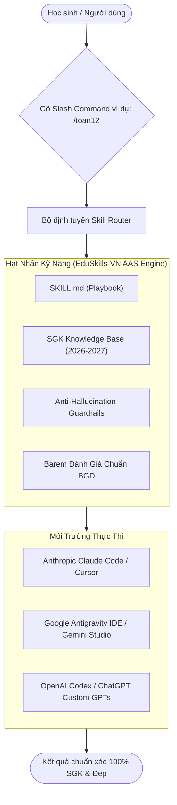

# 🎓 EduSkills-VN: Bộ Não Agentic AI Skills Dành Cho Học Sinh THPT

> **Hệ sinh thái Agentic Skills chuẩn hóa theo Chương trình GDPT 2018 & Định dạng Đề thi Tốt nghiệp THPT 2025–2027 của Bộ Giáo dục & Đào tạo Việt Nam.**  
> Tương thích đa nền tảng: **Claude Code / Cursor**, **Google Antigravity / Gemini**, **OpenAI ChatGPT / Codex**.  
> Cấu trúc thiết kế tham chiếu tiêu chuẩn công nghiệp: [`sickn33/agentic-awesome-skills`](https://github.com/sickn33/agentic-awesome-skills).

---

[](https://opensource.org/licenses/MIT)
[](https://moet.gov.vn)
[](https://moet.gov.vn)
[](#-ma-trận-tương-thích-đa-mô-hình)
[](https://github.com/sickn33/agentic-awesome-skills)

---

## 📌 1. Tại Sao EduSkills-VN Ra Đời? (Problem & Solution)

### Vấn nạn của học sinh khi học bài bằng AI phổ thông:
Hầu hết học sinh khi hỏi bài trên ChatGPT, Gemini hay Claude bản mặc định đều gặp 5 vấn đề nghiêm trọng:
1. **Kết quả "xàm" & ảo giác công thức**: AI giải sai các bước toán học, tự nghĩ ra công thức không có trong SGK, nhảy cóc bước mà không chứng minh.
2. **Lỗi thời so với Chương trình GDPT 2018**: AI vẫn dùng danh pháp Hóa học cũ (*axit axetic, etilen, natri clorit* thay vì *ethanoic acid, ethene, sodium chloride* theo chuẩn IUPAC SGK mới); trích dẫn tác phẩm văn học không thuộc ma trận thi mới.
3. **Đề thi và Quiz sai cấu trúc Bộ Giáo dục**: AI chỉ biết tạo trắc nghiệm 4 lựa chọn đơn giản (A, B, C, D) kiểu cũ, hoàn toàn không biết đến **cấu trúc đề thi mới từ 2025** của Bộ GD&ĐT (Phần II Trắc nghiệm Đúng/Sai tính điểm lũy tiến, Phần III Trả lời ngắn điền số).
4. **Slide thuyết trình và sơ đồ xấu**: AI sinh nội dung slide dạng các đoạn văn dài ngoằng, không phân cấp thị giác, bố cục cẩu thả, không hỗ trợ xuất sang Marp/Reveal.js chuẩn thuyết trình chuyên nghiệp.
5. **Prompting tùy tiện, thiếu tính nhất quán**: Học sinh không biết viết prompt thế nào cho chuẩn sư phạm, dẫn đến AI giải bài theo kiểu "làm hộ bài tập" thay vì giảng giải bản chất (Socratic method).

### Giải pháp đột phá từ EduSkills-VN:
**EduSkills-VN** đóng gói tri thức thành các **Agentic Skills** độc lập (mỗi skill là một cẩm nang chỉ dẫn chuyên gia `SKILL.md` gồm bộ quy tắc chống ảo giác, ma trận kiến thức SGK 3 bộ sách *Kết nối tri thức, Chân trời sáng tạo, Cánh Diều*, và bộ tiêu chí kiểm định nghiêm ngặt).

---

## ⚡ 2. Bảng Tra Cứu Nhanh Hệ Thống Skills (Slash Commands)

Học sinh hoặc lập trình viên chỉ cần gõ lệnh tắt (Slash Command) để kích hoạt chuyên gia tương ứng:

### 🔬 Nhóm Môn Khoa Học Tự Nhiên
| Lệnh Kích Hoạt | Mô Tả Chức Năng Chuyên Biệt | Khối Lớp | Định Dạng Đầu Ra |
| :--- | :--- | :---: | :--- |
| `/toan10` | Giải tích, Hình học tọa độ Oxy, Bất đẳng thức, Thống kê Lớp 10 | 10 | LaTeX chuẩn, bảng biến thiên, giải từng bước |
| `/toan11` | Lượng giác, Cấp số, Giới hạn, Đạo hàm, Hình không gian 11 | 11 | LaTeX chuẩn, hình vẽ minh họa không gian (TikZ/SVG) |
| `/toan12` | Ứng dụng đạo hàm khảo sát hàm số, Tọa độ Oxyz, Tích phân 12 | 12 | Định dạng đề thi BGD 2025-2027, sơ đồ tư duy giải |
| `/vatli10` | Cơ học chuyển động, Động lực học Newton, Năng lượng, Động lượng | 10 | Đơn vị SI, phân tích vector lực, hiện tượng thực tế |
| `/vatli11` | Dao động cơ, Sóng cơ, Điện trường, Dòng điện không đổi | 11 | Đồ thị dao động, sơ đồ mạch điện, hiện tượng vật lí |
| `/vatli12` | Vật lí nhiệt, Khí lí tưởng, Từ trường, Hạt nhân nguyên tử | 12 | Bảng công thức nhiệt/từ, bài tập trắc nghiệm Đúng/Sai |
| `/hoahoc10` | Cấu tạo nguyên tử, Bảng tuần hoàn, Liên kết hóa học, Oxi hóa - khử | 10 | Danh pháp IUPAC, cấu hình electron, năng lượng liên kết |
| `/hoahoc11` | Cân bằng hóa học, Nitrogen - Sulfur, Hóa học hữu cơ đại cương | 11 | Cấu trúc Lewis, phương trình ion thu gọn |
| `/hoahoc12` | Ester - Lipid, Carbohydrate, Hợp chất chứa Nitrogen, Polime | 12 | Cơ chế phản ứng, bài toán hiệu suất, phân loại polime |
| `/sinhhoc10-12`| Sinh học tế bào, Di truyền học Men-đen, Tiến hóa và Sinh thái học | 10-12 | Sơ đồ phả hệ, bảng mã di truyền, bài toán quy luật |

### 📚 Nhóm Môn Khoa Học Xã Hội & Ngôn Ngữ
| Lệnh Kích Hoạt | Mô Tả Chức Năng Chuyên Biệt | Khối Lớp | Định Dạng Đầu Ra |
| :--- | :--- | :---: | :--- |
| `/nguvan10` | Thần thoại, Sử thi, Chèo/Tuồng, Văn bản nghị luận & thông tin 10 | 10 | Bảng giải mã đặc trưng thể loại, mở bài/kết bài mẫu |
| `/nguvan11` | Truyện ngắn hiện thực, Thơ hiện đại, Kịch bản văn học 11 | 11 | Dàn ý chi tiết 3 phần, dẫn chứng lý luận văn học |
| `/nguvan12` | Đọc hiểu ngữ liệu ngoài SGK, Nghị luận xã hội & Nghị luận văn học | 12 | Khung barem chấm điểm BGD (Đọc hiểu 4đ + Viết 6đ) |
| `/lichsu-thpt` | Lịch sử thế giới cận - hiện đại, Lịch sử Việt Nam từ 1858 đến nay | 10-12 | Trục thời gian (Timeline), sơ đồ nguyên nhân - ý nghĩa |
| `/diali-thpt` | Địa lí tự nhiên, dân cư, chuyển dịch cơ cấu kinh tế các vùng | 10-12 | Phân tích Atlat Địa lí Việt Nam, bảng số liệu & biểu đồ |
| `/ktpl-thpt` | Giáo dục Kinh tế & Pháp luật (Cung - cầu, Lạm phát, Hiến pháp) | 10-12 | Xử lí tình huống pháp luật, phân tích ma trận hành vi |
| `/tienganh-thpt`| Ngữ pháp trọng điểm THPT, Collocations, Đọc hiểu IELTS/BGD format| 10-12 | Bảng từ vựng phiên âm IPA, giải thích ngữ cảnh bẫy |

### 🛠️ Nhóm Meta-Skills: Công Cụ Tác Vụ Học Tập Thông Minh
| Lệnh Kích Hoạt | Mô Tả Chức Năng | Điểm Đột Phá Khác Biệt |
| :--- | :--- | :--- |
| `/taoquiz-bgd` | Tạo đề thi thử & trắc nghiệm chuẩn ma trận BGD 2025–2027 | **Đủ 3 phần**: Phần I (Nhiều lựa chọn), Phần II (Đúng/Sai lũy tiến điểm), Phần III (Trả lời ngắn) kèm đáp án chi tiết. |
| `/slide-thuyettrinh` | Sinh mã thuyết trình Marp/HTML chuẩn visual sang trọng | Thiết kế chuẩn tỷ lệ 16:9, bảng màu hiện đại, tối đa 6 dòng/slide, hiệu ứng micro-animations, không generic AI. |
| `/tomtat-mindmap` | Tóm tắt kiến thức SGK ra Mermaid Mindmap & Cheatsheet | Sơ đồ tư duy trực quan, bảng so sánh đa chiều, nhớ nhanh công thức cốt lõi. |
| `/giai-chi-tiet` | Trợ giảng giải bài tập theo phương pháp Socrates | Không đưa ngay đáp án; gợi mở tư duy từng bước, giải thích "tại sao lại chọn công thức này", cảnh báo bẫy sai lầm. |
| `/luan-an-nghiencuu`| Hướng dẫn NCKH kỹ thuật học sinh THPT (ViSEF) & Trải nghiệm | Khung phương pháp nghiên cứu, đề xuất giả thuyết khoa học, thiết kế khảo sát và cấu trúc bài báo cáo chuẩn học thuật. |

---

## 🧩 3. Ma Trận Tương Thích Đa Mô Hình (Multi-Model Matrix)

EduSkills-VN được thiết kế theo nguyên lý **"Decoupled Knowledge & Platform-Agnostic Execution"**:



| Nền Tảng | Model Đề Xuất | Phương Thức Tích Hợp | Tính Năng Nổi Bật |
| :--- | :--- | :--- | :--- |
| **Google Antigravity / Gemini** | Gemini 2.0 Flash / Pro | Skill folder trong `.gemini/config/` | Tốc độ siêu nhanh, context window cực lớn (2M tokens) nuốt trọn cả cuốn SGK |
| **Claude Code / Cursor** | Claude 3.5 Sonnet | File `SKILL.md` hoặc `.cursorrules` | Tư duy lập luận môn Toán/Văn siêu sâu sắc, viết văn mượt mà giàu cảm xúc |
| **OpenAI / ChatGPT** | GPT-4o / GPT-4.5 | Custom Instructions / Custom GPTs | Đa năng, xử lý hội thoại mượt, công cụ trắc nghiệm linh hoạt |

---

## 📂 4. Cấu Trúc Thư Mục Chuẩn

Thiết kế mô-đun hóa phỏng theo kiến trúc của `sickn33/agentic-awesome-skills`:

```text
skillsGeminiTHPT/
├── readme.md                           # Trang chủ & bảng tra cứu hệ thống
├── .gitignore                          # Loại trừ file tạm và file PDF SGK nặng
├── docs/                               # Bộ tài liệu thiết kế & kỹ thuật chuyên sâu
│   ├── 01_IDEA_AUTOPSY_AND_VALIDATION.md    # Khám nghiệm ý tưởng & giải mã bẫy AI
│   ├── 02_ARCHITECTURE_AGENTIC_SKILLS.md     # Bản đặc tả kiến trúc chuẩn SKILL.md
│   ├── 03_CURRICULUM_BGD_2026_STANDARDS.md   # Chuẩn GDPT 2018 & Quy chế thi BGD mới
│   ├── 04_SKILLS_CATALOG_MATRIX.md           # Ma trận chi tiết 36+ skills
│   ├── 05_PDF_EXTRACTION_PIPELINE.md         # Pipeline trích xuất PDF SGK Azure AI
│   ├── 06_TESTING_AND_BENCHMARK_FRAMEWORK.md # Bộ tiêu chí kiểm thử & Benchmark
│   └── 07_ROADMAP_AND_TASK_BOARD.md          # Lộ trình triển khai & Bảng việc mã màu
├── skills/                             # Thư mục chứa từng Agentic Skill độc lập
│   ├── toan-thpt/                      # Skill Toán học THPT (Lớp 10, 11, 12)
│   │   ├── SKILL.md
│   │   └── references/
│   ├── ngu-van-thpt/                   # Skill Ngữ văn THPT
│   │   ├── SKILL.md
│   │   └── references/
│   ├── vat-li-thpt/                    # Skill Vật lí THPT
│   ├── hoa-hoc-thpt/                   # Skill Hóa học THPT (Chuẩn IUPAC)
│   ├── tao-quiz-bgd/                   # Meta-skill tạo đề thi chuẩn 3 phần
│   ├── slide-thuyet-trinh/             # Meta-skill tạo slide Marp chuẩn visual
│   └── tomtat-mindmap/                 # Meta-skill tóm tắt sơ đồ tư duy Mermaid
└── sgk/                                # Kho dữ liệu SGK Lớp 10, 11, 12 (Lưu cục bộ)
    ├── PDF SGK Lớp 10 2026-2027/
    ├── PDF SGK Lớp 11 2026-2027/
    └── PDF SGK Lớp 12 2026-2027/
```

---

## 🚀 5. Hướng Dẫn Cài Đặt & Sử Dụng Nhanh (Quickstart)

### Cách 1: Sử dụng trực tiếp trong Antigravity IDE (Gemini)
1. Clone kho lưu trữ về thư mục cấu hình của bạn:
   ```bash
   git clone https://github.com/Wothing0406/EduSkills-VN.git
   ```
2. Mở dự án trong Antigravity IDE. Hệ thống tự động nhận diện các skills trong thư mục `skills/`.
3. Nhập lệnh trực tiếp vào khung chat:
   ```text
   /toan12 Giải bài toán tìm giá trị lớn nhất, nhỏ nhất của hàm số y = x^3 - 3x + 2 trên đoạn [0; 2]
   ```

### Cách 2: Sử dụng trong Claude Code / Cursor
- Đọc file playbook của skill cần dùng:
  ```text
  Please apply the instructions from skills/tao-quiz-bgd/SKILL.md to generate a 15-minute physics quiz for Grade 12.
  ```

---

## 📚 6. Khám Phá Chi Tiết Bộ Tài Liệu Kỹ Thuật

| Tài Liệu | Tóm Tắt Nội Dung |
| :--- | :--- |
| 📖 [**01. Khám Nghiệm Ý Tưởng (Idea Autopsy)**](docs/01_IDEA_AUTOPSY_AND_VALIDATION.md) | Phân tích tử huyệt của AI học tập truyền thống, 5 bộ lọc khắt khe và rào cản phòng vệ (Moat). |
| 🏗️ [**02. Kiến Trúc Agentic Skills**](docs/02_ARCHITECTURE_AGENTIC_SKILLS.md) | Đặc tả cấu trúc `SKILL.md`, YAML Schema, bộ lọc chống ảo giác và adapter đa mô hình. |
| 📜 [**03. Chuẩn BGD 2026–2027**](docs/03_CURRICULUM_BGD_2026_STANDARDS.md) | Toàn bộ ma trận đề thi tốt nghiệp THPT mới (Phần I, II, III), chuẩn IUPAC và LaTeX. |
| 🗺️ [**04. Ma Trận Danh Mục Skills**](docs/04_SKILLS_CATALOG_MATRIX.md) | Chi tiết 36+ skills cho từng môn học và các meta-skills học tập thông minh. |
| ⚙️ [**05. Pipeline Trích Xuất PDF SGK**](docs/05_PDF_EXTRACTION_PIPELINE.md) | Bóc tách bảng, công thức, bài tập SGK bằng Azure AI Document Intelligence. |
| 🧪 [**06. Khung Kiểm Thử & Benchmark**](docs/06_TESTING_AND_BENCHMARK_FRAMEWORK.md) | Tiêu chí rubrics, bộ test chống ảo giác và thang điểm đánh giá thẩm mỹ slide. |
| 📋 [**07. Lộ Trình & Bảng Phân Việc**](docs/07_ROADMAP_AND_TASK_BOARD.md) | Bảng công việc phân cấp mã màu (`🔴 P0`, `🟡 P1`, `🟢 P2`, `🟣 P3`). |

---

## 🤝 7. Đóng Góp & Giấy Phép (License)

Dự án được phân phối dưới giấy phép mã nguồn mở **MIT License**. Mọi đóng góp từ giáo viên, sinh viên sư phạm và học sinh THPT trên toàn quốc nhằm hoàn thiện bộ kỹ năng đều được hoan nghênh nồng nhiệt!
