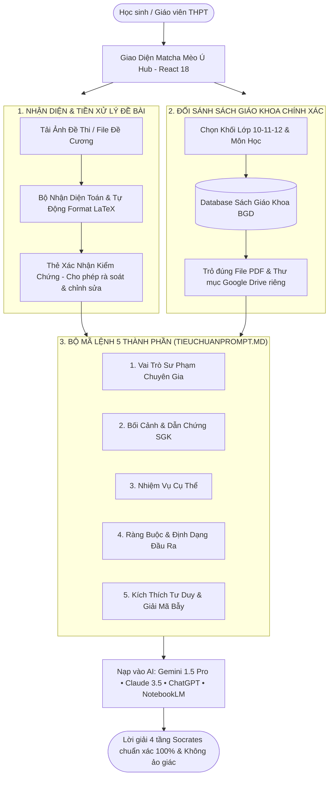

# 🍵 EduSkills-VN: The Agentic AI Brain for Vietnamese High School Education
### 🇻🇳 Hệ Sinh Thái Agentic AI Skills THPT Chuẩn Bộ Giáo Dục & Đào Tạo 2026–2027

> **Phiên bản:** `Beta v0.1.2-beta`  
> **Giao diện cốt lõi:** Matcha Mèo Ú Tối Giản (Cozy Minimalist Cat & Matcha Workspace - React 18)  
> **Kiến trúc tiêu chuẩn:** AAS Core Specification ([`sickn33/agentic-awesome-skills`](https://github.com/sickn33/agentic-awesome-skills))  
> **Tiêu chuẩn thiết kế Prompt:** Khung 5 Thành Phần Tuyệt Đối Chuẩn Hóa ([`docs/Tieuchuanprompt.md`](docs/Tieuchuanprompt.md))  
> **Chuẩn dữ liệu:** Bộ Sách Giáo Khoa Thống Nhất Toàn Quốc từ năm 2026 (Lớp 10, 11, 12) & Định dạng Đề thi Tốt nghiệp THPT 2025–2027 (Quyết định 764/QĐ-BGDĐT).  
> **Tác giả & Chủ nhiệm dự án:** **Nguyễn Duy Quang** (📞 `0795277227` | ✉️ `poiairo4628@gmail.com`)

---

[](#)
[](#)
[](docs/Tieuchuanprompt.md)
[](https://moet.gov.vn)
[](https://moet.gov.vn)
[](#-3-tủ-sách-sgk-điện-tử-cloud--đối-sánh-chính-xác-từng-file-pdf)
[](docs/08_USER_GUIDE_HUONG_DAN_SU_DUNG.md)
[](https://opensource.org/licenses/MIT)

---

## 🍵 1. Bản Sắc Riêng: Triết Lý "Matcha Mèo Ú Tối Giản"

Thay vì các giao diện 3D rườm rà làm quạt máy tính kêu to và gây xao nhãng khi học tập, **EduSkills-VN** định hình một bản sắc hoàn toàn riêng biệt:
- 🐱 **Linh vật Mèo Ú Thưởng Trà:** Biểu tượng của sự kiên nhẫn, điềm tĩnh và thông tuệ, xua tan áp lực thi cử căng thẳng.
- 🍵 **Tone màu Matcha Latte & Bọt Sữa:** Gam màu xanh trà matcha dịu mắt (`#385E47`, `#588B69`), nền kem sữa thanh lịch (`#F7F9F6`), bảo vệ thị lực tối đa cho học sinh khi tự học đêm muộn.
- ⚡ **Nền tảng React 18 & Zero-Lag:** Giao diện phản hồi tức thì dưới 16ms, tích hợp trình soạn lệnh tương tác (**5-Part Prompt Builder**), tải offline qua Native Blob và hỗ trợ xem tài liệu ngay trong trình duyệt.



---

## 📸 2. Nhận Diện Đề Toán & Tự Động Format LaTeX Kèm Xác Nhận Kiểm Chứng

Học sinh và giáo viên không cần mất công gõ lại các công thức toán phức tạp:

1. **Hỗ trợ đa định dạng tài liệu:**
   - Kéo thả hoặc tải lên hình ảnh chụp bài tập: `.png`, `.jpg`, `.jpeg`, `.webp`.
   - Tải lên tài liệu đề cương: `.pdf`, `.docx`, `.txt`, `.md`.
   - Hiển thị ảnh thu nhỏ (thumbnail) tức thì để đối chiếu đề bài gốc.
2. **Bộ chuyển đổi công thức Toán sang LaTeX tự động (`formatMathProblem`):**
   - Tự động chuẩn hóa phân số dạng `a/b` thành `\frac{a}{b}`.
   - Chuẩn hóa số mũ `x^2`, `x^(n+1)`, căn thức `căn(x)` thành `\sqrt{x}`.
   - Chuẩn hóa giới hạn `lim(x->a)` thành `\lim_{x \to a}`.
   - Chuẩn hóa vector `vec(u)` thành `\vec{u}`.
   - Chuẩn hóa và căn lề 4 phương án trắc nghiệm **A, B, C, D** rõ ràng.
3. **Thẻ Xác Nhận Kiểm Chứng (Math Verification Card):**
   - Đề bài sau khi được nhận diện và định dạng LaTeX sẽ hiển thị trong một khung kiểm chứng riêng biệt.
   - Học sinh có thể kiểm tra xem hệ thống nhận diện đúng hay sai, tự do bổ sung hoặc tinh chỉnh công thức trước khi đưa vào lời nhắc.
   - Bấm nút **"✅ Chèn Vào Trình Ghép Prompt"** để nạp đề toán đã chuẩn hóa vào khung tạo prompt chỉ trong 1 thao tác.

---

## 📚 3. Tủ Sách SGK Điện Tử Cloud & Đối Sánh Chính Xác Từng File PDF

> [!IMPORTANT]  
> **Giải quyết dứt điểm link Drive chung chung:** Thay vì chỉ dẫn về một thư mục Drive lớn chung chung khiến người học bối rối không biết tìm ở đâu, EduSkills-VN đã lập chỉ mục chi tiết toàn bộ các đầu sách giáo khoa chính khóa của Bộ GD&ĐT cho từng môn học và khối lớp.

Khi học sinh chọn môn học và khối lớp trên giao diện, hệ thống sẽ tự động tra cứu trong `dataset/books-database.json` và trích xuất:
- **Tên sách giáo khoa chính thức:** (Ví dụ: *SGK Toán 12 - Tập 1*, *SGK Vật lí 12*, *SGK Hóa học 10*).
- **Mã file PDF gốc:** (Ví dụ: `12-sgk-toan-12-tap-mot.pdf`, `12-shs-vat-li-12.pdf`).
- **Liên kết Google Drive chính xác:** Đường link trực tiếp đến thư mục chứa file PDF của đúng khối lớp đó.

### Bảng Tra Cứu Kho Sách Giáo Khoa Điện Tử (Dung lượng > 2.03GB):

| Khối Lớp | Số Lượng File PDF | Môn Học Đại Diện & Tên File Gốc | Liên Kết Google Drive Trực Tiếp |
| :---: | :---: | :--- | :---: |
| 📗 **Lớp 10** | **74 files** | • Toán T1 & T2 (`10-sgk-toan-10-tap-mot.pdf`)<br/>• Vật lí (`10-sgk-vat-li-10.pdf`)<br/>• Hóa học (`10-sgk-hoa-hoc-10.pdf`)<br/>• Tiếng Anh Global Success (`10-sgk-tieng-anh-10-global-sucess.pdf`) | [👉 Mở Kho Sách Lớp 10](https://drive.google.com/drive/folders/1H4BU2OMP1h5VJUtF8iQp9Dpmo40oHX6o?usp=drive_link) |
| 📘 **Lớp 11** | **10 files** | • Toán T1 & T2 (`11-sgk-toan-11-tap-mot.pdf`)<br/>• Vật lí (`11-sgk-vat-li-11.pdf`)<br/>• Chuyên đề Hóa học (`11-sgk-chuyen-de-hoc-tap-hoa-hoc-11.pdf`) | [👉 Mở Kho Sách Lớp 11](https://drive.google.com/drive/folders/1w8QOaRc_V5It9Xh0PvT_QwO_G7V22jZr?usp=drive_link) |
| 📙 **Lớp 12** | **46 files** | • Toán T1 & T2 (`12-sgk-toan-12-tap-mot.pdf`, `12-sgk-toan-12-tap-hai.pdf`)<br/>• Vật lí (`12-shs-vat-li-12.pdf`)<br/>• Hóa học IUPAC (`12-sgk-hoa-hoc-12.pdf`)<br/>• Sinh học Di truyền (`12-sgk-sinh-hoc-12.pdf`) | [👉 Mở Kho Sách Lớp 12 (Trọng tâm thi)](https://drive.google.com/drive/folders/1I3h4nfdJTO5KdPsD4UWYdYJlMXQL1YwD?usp=drive_link) |

---

## 🎯 4. Tiêu Chuẩn Thiết Kế Prompt 5 Thành Phần ([`docs/Tieuchuanprompt.md`](docs/Tieuchuanprompt.md))

Mọi mã lệnh sinh ra từ EduSkills-VN đều tuân thủ nghiêm ngặt 5 thành phần nền tảng:

```text
[1. VAI TRÒ (ROLE)]
  └─ Bạn là chuyên gia sư phạm THPT chuyên sâu về [Môn học] chuẩn Bộ GD&ĐT Việt Nam...

[2. BỐI CẢNH & DỮ LIỆU THAM CHIẾU (CONTEXT & GROUNDING)]
  ├─ Sách Giáo Khoa: [Tên Sách Cụ Thể, ví dụ: SGK Toán 12 - Tập 1]
  ├─ Mã File PDF Gốc: [12-sgk-toan-12-tap-mot.pdf]
  ├─ Nguồn tài liệu Cloud: [Link Google Drive Khối Lớp Tương Ứng]
  └─ Khung chương trình: Chương trình GDPT 2018 & Định dạng đề thi QĐ 764/QĐ-BGDĐT.

[3. NHIỆM VỤ CỤ THỂ (TASK)]
  └─ Giải bài tập / Tạo đề thi / Tóm tắt bài học theo yêu cầu chi tiết...

[4. RÀNG BUỘC & ĐỊNH DẠNG ĐẦU RA (CONSTRAINTS & FORMAT)]
  ├─ 100% công thức toán học/vật lí viết bằng LaTeX đặt trong cặp dấu $...$.
  ├─ Danh pháp hóa học tuân thủ tuyệt đối IUPAC tiếng Anh.
  └─ Trình bày tường minh theo khung sư phạm 4 tầng Socrates.

[5. KÍCH THÍCH TƯ DUY SÂU & GIẢI MÃ BẪY (COGNITIVE PROMPTS)]
  ├─ Tầng 1: Gợi ý tư duy Socrates (không làm lộ đáp số).
  ├─ Tầng 2: Bản chất lý thuyết & Chiến thuật tiếp cận tối ưu.
  ├─ Tầng 3: Lời giải chi tiết từng bước (Full Step-by-Step).
  └─ Tầng 4: Giải mã bẫy phòng thi & Bài tập tự luyện tương tự.
```

---

## 📂 5. Bản Đồ 16 Kỹ Năng Chuẩn Hóa (`skills/`)

```text
skills/
├── khoa-hoc-tu-nhien/         # 🔬 Môn Khoa Học Tự Nhiên
│   ├── toan-thpt/SKILL.md     # /toan10-12: Giải tích 10-12, Tiệm cận xiên, Tối ưu hóa thực tế
│   ├── vat-li-thpt/SKILL.md   # /vatli10-12: Khí lí tưởng, Nhiệt động lực học, Đơn vị SI, Kelvin
│   ├── hoa-hoc-thpt/SKILL.md  # /hoahoc10-12: 100% IUPAC tiếng Anh, Enthalpy, Pin điện hóa
│   └── sinh-hoc-thpt/SKILL.md # /sinhhoc-thpt: Di truyền phân tử, Sơ đồ phả hệ, Di truyền quần thể
├── khoa-hoc-xa-hoi/          # 📚 Môn Khoa Học Xã Hội
│   ├── ngu-van-thpt/SKILL.md  # /nguvan10-12: Đọc hiểu ngoài SGK (4đ), Đoạn văn 200 chữ, Bài văn NLVH
│   ├── lich-su-thpt/SKILL.md  # /lichsu-thpt: Trục thời gian lịch sử, Phân tích nguyên nhân bước ngoặt
│   ├── dia-li-thpt/SKILL.md   # /diali-thpt: Xử lý số liệu, Biểu đồ kinh tế và Khai thác Atlat
│   └── ktpl-thpt/SKILL.md     # /ktpl-thpt: Cơ chế thị trường, Tín dụng, Tình huống pháp luật
├── ngon-ngu-cong-nghe/       # 💻 Ngôn Ngữ & Kỹ Thuật
│   ├── tieng-anh-thpt/SKILL.md# /tienganh-thpt: Ngữ pháp trọng điểm, Phiên âm IPA, Đọc hiểu phân hóa
│   ├── tin-hoc-thpt/SKILL.md  # /tinhoc-thpt: Thuật toán Python, CSDL quan hệ SQL, An toàn số
│   └── cong-nghe-thpt/SKILL.md# /congnghe-thpt: Mạch điện xoay chiều, Vi điều khiển, Nông nghiệp 4.0
└── meta-tools/               # 🛠️ Công Cụ Học Tập Thông Minh
    ├── giai-chi-tiet/SKILL.md # /giai-chi-tiet: Lời giải 4 tầng Socrates triệt tiêu bẫy
    ├── tao-quiz-bgd/SKILL.md  # /taoquiz-bgd: Đề thi 3 phần chuẩn QĐ 764 kèm giải mã bẫy
    ├── slide-thuyet-trinh/SKILL.md # /slide-thuyettrinh: Slide Marp & Tailwind HTML 16:9 cao cấp
    ├── tomtat-mindmap/SKILL.md# /tomtat-mindmap: Sơ đồ tư duy Mermaid & Cheatsheet Cornell 60s
    └── luan-an-nghiencuu/SKILL.md # /luan-an-nghiencuu: Cố vấn nghiên cứu KHKT THPT (ViSEF 5 phần)
```

---

## 📖 6. Cẩm Nang Hướng Dẫn Sử Dụng Nhanh (5 Bước)

> Xem tài liệu chi tiết đầy đủ tại: [📘 `docs/08_USER_GUIDE_HUONG_DAN_SU_DUNG.md`](docs/08_USER_GUIDE_HUONG_DAN_SU_DUNG.md)

1. **Bước 1: Chọn Kỹ Năng & Môn Học:** Chọn môn học cần làm việc (ví dụ: *Toán THPT* hoặc *Giải Toán & Khoa Học 4 Tầng Socrates*).
2. **Bước 2: Tải Ảnh hoặc Tài Liệu Bài Tập:** Kéo thả ảnh chụp đề bài bài tập vào vùng dropzone. Hệ thống tự động nhận diện và chuyển đổi sang công thức LaTeX.
3. **Bước 3: Xác Nhận & Kiểm Chứng Đề Toán:** Đọc lại đề bài trong **Thẻ Xác Nhận Kiểm Chứng**, chỉnh sửa số liệu nếu cần và bấm **"✅ Chèn Vào Trình Ghép Prompt"**.
4. **Bước 4: Chọn Sách Giáo Khoa Cụ Thể:** Hệ thống sẽ tự động gán đúng tên sách (ví dụ: *SGK Toán 12 - Tập 1*), file PDF gốc và link Google Drive vào nội dung Prompt.
5. **Bước 5: Sao Chép & Nạp Vào AI:** Bấm **"Sao Chép Prompt"** rồi dán vào Gemini 1.5 Pro, Claude 3.5 Sonnet, ChatGPT hoặc NotebookLM để nhận lời giải 4 tầng đỉnh cao.

---

## 🚀 7. Cài Đặt & Khởi Chạy Local Hub

Hệ thống hỗ trợ chạy cục bộ cực kỳ đơn giản cho cả người dùng không rành công nghệ:

```bash
# 1. Clone kho lưu trữ mã nguồn mở về máy
git clone https://github.com/Wothing0406/EduSkills-VN.git
cd EduSkills-VN

# 2. Khởi chạy 1-click trên Windows (Dành cho học sinh & giáo viên)
start-eduskills.bat

# Hoặc khởi chạy qua dòng lệnh Node.js:
npm install
npm run dev
```

Hệ thống sẽ tự động xác minh tính toàn vẹn của 16/16 kỹ năng và mở giao diện **Matcha Mèo Ú Workspace** tại địa chỉ: `http://localhost:3000`.

---

## 📞 8. Tác Giả & Hỗ Trợ Cộng Đồng

Dự án được xây dựng và duy trì bởi:
*   **Chủ nhiệm dự án:** **Nguyễn Duy Quang**
*   **Điện thoại / Zalo:** **`0795277227`**
*   **Email học thuật:** **`poiairo4628@gmail.com`**
*   **GitHub Repository:** [https://github.com/Wothing0406/EduSkills-VN](https://github.com/Wothing0406/EduSkills-VN)

Dự án phát hành dưới giấy phép mã nguồn mở **MIT License**. Chung tay vì một thế hệ học sinh Việt Nam làm chủ trí tuệ nhân tạo một cách văn minh, chuẩn mực và sáng tạo!