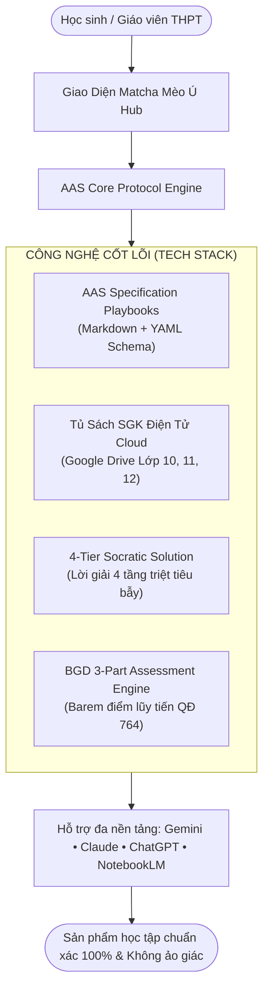

# 🍵 EduSkills-VN: The Agentic AI Brain for Vietnamese High School Education
### 🇻🇳 Hệ Sinh Thái Agentic AI Skills THPT Chuẩn Bộ Giáo Dục & Đào Tạo 2026–2027

> **Phiên bản:** `Beta v0.1.2-beta`  
> **Giao diện cốt lõi:** Matcha Mèo Ú Tối Giản (Cozy Minimalist Cat & Matcha Workspace)  
> **Kiến trúc tiêu chuẩn:** AAS Core Specification ([`sickn33/agentic-awesome-skills`](https://github.com/sickn33/agentic-awesome-skills))  
> **Chuẩn dữ liệu:** Bộ Sách Giáo Khoa Thống Nhất Toàn Quốc từ năm 2026 (Lớp 10, 11, 12) & Định dạng Đề thi Tốt nghiệp THPT 2025–2027 (Quyết định 764/QĐ-BGDĐT).  
> **Tác giả & Chủ nhiệm dự án:** **Nguyễn Duy Quang** (📞 `0795277227` | ✉️ `poiairo4628@gmail.com`)

---

[](#)
[](#)
[](https://moet.gov.vn)
[](https://moet.gov.vn)
[](#-tủ-sách-sgk-điện-tử-google-drive-cloud-storage)
[](https://github.com/sickn33/agentic-awesome-skills)
[](https://opensource.org/licenses/MIT)

---

## 🍵 1. Bản Sắc Riêng: Triết Lý "Matcha Mèo Ú Tối Giản"

Thay vì các giao diện 3D nặng nề làm quạt máy tính kêu to và gây xao nhãng khi học tập, **EduSkills-VN v0.1.2-beta** định hình một bản sắc hoàn toàn riêng biệt:
- 🐱 **Linh vật Mèo Ú Thưởng Trà:** Biểu tượng của sự kiên nhẫn, điềm tĩnh và thông tuệ, xua tan áp lực thi cử căng thẳng.
- 🍵 **Tone màu Matcha Latte & Bọt Sữa:** Gam màu xanh trà matcha dịu mắt (`#385E47`, `#588B69`), nền kem sữa thanh lịch (`#F7F9F6`), bảo vệ thị lực tối đa cho học sinh khi tự học đêm muộn.
- ⚡ **Tốc độ ánh sáng & Zero-Lag:** Giao diện tối giản thuần CSS/JS, tải tức thì, tích hợp Workstation sao chép mã nguồn và bộ ghép lệnh linh hoạt (**Interactive Prompt Builder**).



---

## 📚 2. Tủ Sách SGK Điện Tử (Google Drive Cloud Storage)

> [!NOTE]  
> **Giải pháp lưu trữ tối ưu:** Thư mục SGK chứa toàn bộ các đầu sách giáo khoa chuẩn chương trình mới với dung lượng hơn **2.03GB**. Nhằm đảm bảo kho mã nguồn Git gọn nhẹ, không vượt ngưỡng giới hạn 100MB/file của GitHub và thuận tiện truy cập mọi lúc mọi nơi, toàn bộ sách đã được số hóa và đồng bộ lên **Google Drive Cloud Storage**.

Học sinh và giáo viên có thể mở trực tiếp hoặc tải về từng bài học để nạp vào AI:

| Khối Lớp | Phạm Vi Nội Dung | Liên Kết Google Drive Trực Tiếp |
| :---: | :--- | :---: |
| 📗 **Lớp 10** | Trọn bộ SGK Toán, Lí, Hóa, Sinh, Văn, Sử, Địa, Tin, Công nghệ Lớp 10 | [👉 Mở Thư Mục Lớp 10](https://drive.google.com/drive/folders/1H4BU2OMP1h5VJUtF8iQp9Dpmo40oHX6o?usp=drive_link) |
| 📘 **Lớp 11** | Trọn bộ SGK Chuyên đề & Cơ bản Lớp 11 mới nhất | [👉 Mở Thư Mục Lớp 11](https://drive.google.com/drive/folders/1w8QOaRc_V5It9Xh0PvT_QwO_G7V22jZr?usp=drive_link) |
| 📙 **Lớp 12** | Trọn bộ SGK Lớp 12 phục vụ trọng tâm Kỳ thi Tốt nghiệp THPT Quốc gia (SGK Thống Nhất) | [👉 Mở Thư Mục Lớp 12](https://drive.google.com/drive/folders/1I3h4nfdJTO5KdPsD4UWYdYJlMXQL1YwD?usp=drive_link) |

### 💡 Cách nhúng SGK từ Google Drive vào các hệ thống AI:
1. **Google Gemini 1.5 Pro / AI Studio:** Mở link Drive $\to$ Tải file PDF bài học mong muốn $\to$ Đính kèm vào khung chat AI Studio. Cửa sổ ngữ cảnh 2.000.000 tokens của Gemini sẽ đọc trọn vẹn từng trang sách với độ chính xác tuyệt đối.
2. **Google NotebookLM:** Tải file PDF bài học từ Drive $\to$ Tải lên NotebookLM làm **Source Document** $\to$ Bấm **Audio Overview** để nghe bài giảng thảo luận dạng Podcast tự động.
3. **OpenAI Custom GPTs & Claude Projects:** Đính kèm file PDF vào vùng Knowledge để tạo gia sư riêng cho từng môn học.

---

## 💡 3. Nâng Cấp Đột Phá: Lời Giải 4 Tầng Socrates & Giải Mã Bẫy Thi Cử

Giải quyết dứt điểm tình trạng AI giải toán "nhảy cóc bước", đưa công thức ảo hoặc giải thích qua loa, EduSkills-VN v0.1.2-beta chuẩn hóa quy trình sư phạm:

### 🧩 Khung Lời Giải 4 Tầng (`/giai-chi-tiet`)
1. **Tầng 1: Gợi Mở Tư Duy Socrates (Socratic Clue):** Đưa ra câu hỏi gợi ý phương pháp mà không làm lộ ngay đáp số, kích thích học sinh tự suy nghĩ.
2. **Tầng 2: Bản Chất Khoa Học & Chiến Thuật Giải:** Định hình định lý, công thức mấu chốt và hướng đi tối ưu nhất (giải đại số, hàm số hay hình học).
3. **Tầng 3: Lời Giải Chi Tiết Từng Bước (Full Step-by-Step):** Trình bày mạch lạc từng bước, 100% công thức viết bằng LaTeX chuẩn, có căn cứ cho từng phép biến đổi.
4. **Tầng 4: Giải Mã Bẫy Phòng Thi & Mở Rộng:** Chỉ rõ những sai lầm học sinh dễ mắc phải (quên điều kiện, nhầm dấu, sai đơn vị SI) và cung cấp 1 bài tập tương tự tự luyện.

### 🎯 Quy Chuẩn Đề Thi Phân Hóa (`/taoquiz-bgd`)
- **Document-First:** Bắt buộc có dữ liệu đầu vào mới sinh đề thi nhằm triệt tiêu hoàn toàn ảo giác.
- **Giải mã phương án nhiễu (Distractor Breakdown):** Không chỉ đưa đáp án đúng, hệ thống giải thích cặn kẽ tại sao học sinh chọn A, C hoặc D lại bị sai do lỗi tư duy nào.
- **Barem điểm lũy tiến Đúng/Sai:** Đúng 1 ý = 0.1đ; 2 ý = 0.25đ; 3 ý = 0.5đ; 4 ý = 1.0đ.

---

## 📂 4. Bản Đồ 16 Kỹ Năng Chuẩn Hóa (`skills/`)

```text
skills/
├── khoa-hoc-tu-nhien/         # 🔬 Môn Khoa Học Tự Nhiên
│   ├── toan-thpt/SKILL.md     # /toan10-12: Giải tích 10-12, Tiệm cận xiên, Tối ưu hóa thực tế
│   ├── vat-li-thpt/SKILL.md   # /vatli10-12: Khí lí tưởng, Nhiệt động lực học, Đơn vị SI, Kelvin
│   ├── hoa-hoc-thpt/SKILL.md  # /hoahoc10-12: 100% IUPAC tiếng Anh, Enthalpy, Pin điện hóa
│   └── sinh-hoc-thpt/SKILL.md # /sinhhoc-thpt: Di truyền phân tử, Sơ đồ phả hệ, Di truyền quần thể
├── khoa-hoc-xa-hoi/          # 📚 Môn Khoa Học Xã Hội
│   ├── ngu-van-thpt/SKILL.md  # /nguvan10-12: Đọc hiểu ngoài SGK (4đ), Đoạn văn 200 chữ, Bài văn NLVH
│   ├── lich-su-thpt/SKILL.md  # /lichsu-thpt: Trục thời gian lịch sử, Phân tích nguyên nhân bước ngoặt
│   ├── dia-li-thpt/SKILL.md   # /diali-thpt: Xử lý số liệu, Biểu đồ kinh tế và Khai thác Atlat
│   └── ktpl-thpt/SKILL.md     # /ktpl-thpt: Cơ chế thị trường, Tín dụng, Tình huống pháp luật
├── ngon-ngu-cong-nghe/       # 💻 Ngôn Ngữ & Kỹ Thuật
│   ├── tieng-anh-thpt/SKILL.md# /tienganh-thpt: Ngữ pháp trọng điểm, Phiên âm IPA, Đọc hiểu phân hóa
│   ├── tin-hoc-thpt/SKILL.md  # /tinhoc-thpt: Thuật toán Python, CSDL quan hệ SQL, An toàn số
│   └── cong-nghe-thpt/SKILL.md# /congnghe-thpt: Mạch điện xoay chiều, Vi điều khiển, Nông nghiệp 4.0
└── meta-tools/               # 🛠️ Công Cụ Học Tập Thông Minh
    ├── giai-chi-tiet/SKILL.md # /giai-chi-tiet: Lời giải 4 tầng Socrates triệt tiêu bẫy
    ├── tao-quiz-bgd/SKILL.md  # /taoquiz-bgd: Đề thi 3 phần chuẩn QĐ 764 kèm giải mã bẫy
    ├── slide-thuyet-trinh/SKILL.md # /slide-thuyettrinh: Slide Marp & Tailwind HTML 16:9 cao cấp
    ├── tomtat-mindmap/SKILL.md# /tomtat-mindmap: Sơ đồ tư duy Mermaid & Cheatsheet Cornell 60s
    └── luan-an-nghiencuu/SKILL.md # /luan-an-nghiencuu: Cố vấn nghiên cứu KHKT THPT (ViSEF 5 phần)
```

---

## 🚀 5. Hướng Dẫn Cài Đặt & Khởi Chạy Local Hub

Hệ thống hỗ trợ chạy cục bộ cực kỳ đơn giản không đòi hỏi cấu hình phức tạp:

```bash
# 1. Clone kho lưu trữ mã nguồn mở về máy
git clone https://github.com/Wothing0406/EduSkills-VN.git
cd EduSkills-VN

# 2. Khởi chạy 1-click trên Windows (Dành cho học sinh & giáo viên)
start-eduskills.bat

# Hoặc khởi chạy trực tiếp bằng Node.js:
npm install
npm run dev
```

Hệ thống sẽ tự động xác minh tính toàn vẹn của 16/16 kỹ năng và mở giao diện **Matcha Mèo Ú Workspace** tại địa chỉ: `http://localhost:3000`.

---

## 📞 6. Tác Giả & Hỗ Trợ Cộng Đồng

Dự án được xây dựng và duy trì bởi:
*   **Chủ nhiệm dự án:** **Nguyễn Duy Quang**
*   **Điện thoại / Zalo:** **`0795277227`**
*   **Email học thuật:** **`poiairo4628@gmail.com`**
*   **GitHub Repository:** [https://github.com/Wothing0406/EduSkills-VN](https://github.com/Wothing0406/EduSkills-VN)

Dự án phát hành dưới giấy phép mã nguồn mở **MIT License**. Chung tay vì một thế hệ học sinh Việt Nam làm chủ trí tuệ nhân tạo một cách văn minh, chuẩn mực và sáng tạo!