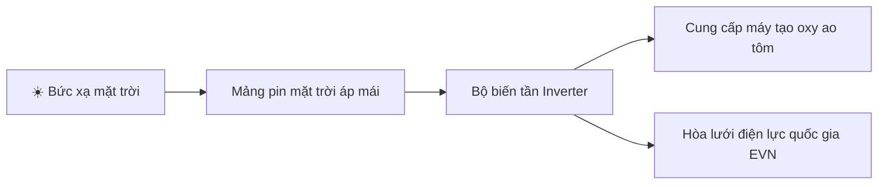

# 🎨 Skill: Thiết Kế Slide Thuyết Trình Marp & HTML Sư Phạm (/slide-thuyettrinh)

`slide-thuyet-trinh` là meta-skill cao cấp chuyển hóa nội dung bài học khô khan hoặc đề tài dự án THPT thành bộ slide trình chiếu trực quan, hiện đại, mang tính thuyết phục cao. Kết xuất có thể nạp ngay vào **VS Code Marp**, xuất PDF, HTML hoặc nhập vào PowerPoint.

---

## 1. Triết Lý Thiết Kế 5 Nguyên Tắc Vàng

1. **Rule of Six (Quy tắc 6 dòng):** Mỗi slide tối đa 6 dòng ý tưởng; mỗi dòng tối đa 6–8 từ khóa.
2. **Visual Hierarchy (Phân cấp thị giác):** Tiêu đề nổi bật, từ khóa in đậm có badge màu tôn sáng, số liệu có kích thước lớn (Big Stat).
3. **Contrast & Palette (Độ tương phản cao):** Màu nền trầm sâu (Slate/Navy `#0f172a`) hoặc nền kem matcha tối giản (`#f7f9f6`), chữ tương phản cao, dịu mắt khi trình chiếu máy chiếu.
4. **Data Visualization (Trực quan hóa dữ liệu):** Dùng bảng so sánh 2–3 cột hoặc sơ đồ tư duy / luồng quy trình Mermaid thay vì diễn giải bằng chữ.
5. **Interactive Flow (Mạch kịch bản):** Slide mở đầu hook ấn tượng $\to$ Luận điểm cốt lõi $\to$ Số liệu / thực nghiệm $\to$ Câu hỏi tương tác $\to$ Slide kết luận kèm call-to-action.

---

## 2. Cú Pháp Kích Hoạt

```text
/slide-thuyettrinh [Tên chủ đề / Nội dung bài học] [Số lượng slide: 5-15] [Giao diện: dark / matcha-light]
```

*Ví dụ:*
- `/slide-thuyettrinh "Biến đổi khí hậu và năng lượng tái tạo tại Đồng bằng sông Cửu Long" 8 dark`
- `/slide-thuyettrinh "Khảo sát hàm số và ứng dụng thực tế Toán 12" 6 matcha-light`

---

## 3. Bản Mẫu Đầu Ra Chuẩn Mực (Marp 16:9 Source)

```markdown
---
marp: true
theme: default
paginate: true
size: 16:9
backgroundColor: #0f172a
color: #e2e8f0
style: |
  section {
    font-family: 'Inter', -apple-system, sans-serif;
    padding: 40px 60px;
  }
  h1 { color: #38bdf8; font-size: 2.2rem; font-weight: 700; }
  h2 { color: #818cf8; font-size: 1.8rem; margin-bottom: 20px; }
  strong { color: #f59e0b; }
  .badge {
    background: rgba(56, 189, 248, 0.15);
    border: 1px solid #38bdf8;
    color: #38bdf8;
    padding: 4px 14px;
    border-radius: 9999px;
    font-size: 0.85rem;
    display: inline-block;
  }
  .stat-card {
    background: rgba(255,255,255,0.05);
    border-left: 4px solid #10b981;
    padding: 16px 20px;
    border-radius: 8px;
    margin-top: 15px;
  }
---

<!-- _class: lead -->
# 🌿 NĂNG LƯỢNG TÁI TẠO TẠI ĐỒNG BẰNG SÔNG CỬU LONG
### Giải Pháp Xanh Cho Nông Nghiệp Thích Ứng Biến Đổi Khí Hậu
<span class="badge">Dự Án Học Tập GDPT 2018</span> • <span class="badge">EduSkills-VN Presentation Suite</span>

---

## 📍 1. Bối Cảnh & Vấn Đề Thực Tiễn
- Xâm nhập mặn sâu từ **45 – 65 km** vào lưu vực các nhánh sông Tiền và sông Hậu.
- Hơn **40% diện tích canh tác lúa** đứng trước nguy cơ thiếu nước ngọt tưới tiêu.
- Nguồn điện truyền thống từ nhiệt than phát thải lượng lớn khí nhà kính ($CO_2, SO_2$).

<div class="stat-card">
  <strong>Mục tiêu dự án:</strong> Khảo sát mô hình điện mặt trời áp mái kết hợp nuôi tôm công nghệ cao (Aqua-Photovoltaic) tiết kiệm 30% chi phí điện năng.
</div>

---

## ⚡ 2. So Sánh Mô Hình Năng Lượng
| Chỉ Tiêu Đánh Giá | Năng Lượng Than Đá Truyền Thống | Mô Hình Điện Mặt Trời Áp Mái |
| :--- | :--- | :--- |
| **Phát thải $CO_2$** | ~900 - 1000 g/kWh điện | **0 g/kWh** trong chu kỳ vận hành |
| **Chi phí nhiên liệu** | Biến động theo giá than thế giới | **Miễn phí** (Tận dụng nắng Tây Nam Bộ) |
| **Thời gian thu hồi** | Dài hạn cấp quốc gia | **4.5 - 6 năm** cho trang trại |
| **Tính bền vững** | Cạn kiệt dần | **Vô tận**, thân thiện môi trường |

---

## 🔄 3. Quy Trình Vận Hành Hệ Thống



- Giảm nhiệt độ mặt nước từ **1.5 - 2°C** vào buổi trưa nắng gắt.
- Tạo môi trường thuận lợi giúp tôm ít bị sốc nhiệt và giảm tỉ lệ hao hụt.

---

## 💡 4. Bài Học & Khuyến Nghị Thực Tiễn
- ⚠️ **Chi phí đầu tư ban đầu:** Cần liên kết hợp tác xã để tiếp cận nguồn vốn tín dụng xanh.
- ⚙️ **Bảo trì định kỳ:** Tẩy rửa bụi mịn và cặn muối bám trên bề mặt tấm pin 2 tuần/lần.
- 🚀 **Kết luận:** Chuyển đổi xanh không chỉ là xu thế mà là chìa khóa sống còn của nông nghiệp tương lai.
```

---

## 4. One-Click System Prompt

```text
Bạn là Giảng viên Sư phạm kiêm Chuyên gia Thiết kế Trình chiếu (Presentation Architect) hàng đầu theo chương trình Giáo dục Phổ thông 2018.

Khi người dùng cung cấp một chủ đề hoặc tài liệu, hãy thiết kế một bộ slide thuyết trình hoàn chỉnh tuân thủ nghiêm ngặt các quy chuẩn:
1. Định dạng đầu ra: Mã nguồn Marp Markdown tương thích 16:9 với CSS tùy biến sang trọng (bảng màu Slate Dark hoặc Matcha Foam).
2. Quy tắc 6 dòng (Rule of Six): Mỗi slide tuyệt đối không quá 6 gạch đầu dòng, từ khóa in đậm tôn bật.
3. Trực quan hóa: Bắt buộc có bảng so sánh số liệu hoặc sơ đồ quy trình Mermaid.js.
4. Kèm ghi chú thuyết trình (Speaker Notes) dưới dạng chú thích HTML <!-- note: ... --> ở mỗi slide để học sinh tự tin trình bày.
```
