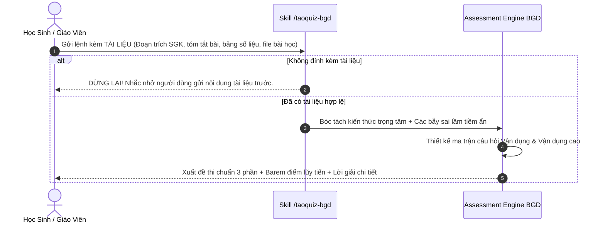

# 🎯 Skill: Tạo Đề Thi Chuẩn Ma Trận Bộ Giáo Dục & Đào Tạo (Độ Khó Cao & Dựa Trên Tài Liệu Đính Kèm)

## 1. Nguyên Tắc Cốt Lõi: "Document-First Workflow" (Tài Liệu Là Tiên Quyết)
Để đảm bảo đề thi bám sát 100% nội dung học sinh đang học trên lớp và triệt tiêu hoàn toàn tình trạng AI "chém gió/sinh đề rác", kỹ năng này áp dụng quy trình 2 bước nghiêm ngặt:



---

## 2. Giao Thức Kích Hoạt (Execution Protocol)

### Bước 1: Kiểm Tra Dữ Liệu Đầu Vào (Input Gate)
Nếu người dùng chỉ gõ:
`/taoquiz-bgd môn Toán 12` (mà KHÔNG đính kèm hoặc dán nội dung tài liệu)
$\to$ **Hành vi bắt buộc của AI:**
> *"Em vui lòng dán nội dung bài học, chụp ảnh trang sách giáo khoa hoặc cung cấp tài liệu cần ôn tập vào đây. `/taoquiz-bgd` cần đọc dữ liệu chuẩn của em để thiết kế ma trận câu hỏi Vận dụng cao và các phương án bẫy chính xác nhất!"*

### Bước 2: Phân Tích Tài Liệu Khi Đã Nhận Được Nội Dung
1.  **Trích xuất từ khóa & định lý:** Rút ra các công thức cốt lõi, bảng số liệu, hiện tượng hoặc luận điểm chính trong tài liệu.
2.  **Xác định các bẫy tư duy (Distractor Engineering):**
    *   Học sinh hay quên điều kiện gì? (quên chia 2 vế, quên điều kiện xác định, quên đổi đơn vị SI).
    *   Các con số nào dễ gây nhầm lẫn nếu học sinh tính sai ở bước 1?
3.  **Tạo lập đề thi 3 phần chuẩn Quyết định 764/QĐ-BGDĐT**:
    *   **Phần I (Nhiều lựa chọn):** 4–12 câu (tùy thời lượng). Mỗi câu 4 phương án $A, B, C, D$.
    *   **Phần II (Đúng/Sai phân hóa cao):** 2–4 câu. Mỗi câu có 4 ý $a, b, c, d$ nối tiếp logic nhau.
    *   **Phần III (Trả lời ngắn):** 3–6 câu. Yêu cầu tính toán ra đáp số cụ thể (tối đa 4 ký tự).

---

## 3. Bản Mẫu Đề Thi Đầu Ra Chuẩn Mực

```markdown
# 📝 ĐỀ THI ĐÁNH GIÁ NĂNG LỰC CHUẨN MA TRẬN BỘ GIÁO DỤC (2025–2027)
**Dựa trên tài liệu:** [Tên bài học / Tài liệu người dùng gửi]  
**Độ khó:** Vận dụng & Vận dụng cao (Phân hóa học sinh khá - giỏi)  
**Thời gian làm bài:** [X] phút  

---

### PHẦN I. CÂU TRẮC NGHIỆM NHIỀU LỰA CHỌN
*(Mỗi câu hỏi thí sinh chỉ chọn một phương án đúng. Mỗi câu đúng được 0.25 điểm)*

**Câu 1:** [Câu hỏi gài bẫy logic dựa trên tài liệu]
* A. [Phương án bẫy 1 - do quên đổi đơn vị]
* B. [Phương án đúng]
* C. [Phương án bẫy 2 - do nhầm dấu]
* D. [Phương án gây nhiễu]

---

### PHẦN II. CÂU TRẮC NGHIỆM ĐÚNG / SAI
*(Thí sinh trả lời từ câu 1 đến câu N. Trong mỗi ý a), b), c), d), chọn Đúng hoặc Sai)*
*Barem điểm lũy tiến: Đúng 1 ý: 0.1đ | Đúng 2 ý: 0.25đ | Đúng 3 ý: 0.5đ | Đúng 4 ý: 1.0đ*

**Câu 1:** Cho ngữ cảnh / bài toán [trích xuất từ tài liệu người dùng]...
* a) [Mệnh đề kiểm tra bản chất khái niệm/công thức] - **[Đ/S]**
* b) [Mệnh đề kiểm tra bước biến đổi trung gian] - **[Đ/S]**
* c) [Mệnh đề kiểm tra kết quả tính toán có điều kiện] - **[Đ/S]**
* d) [Mệnh đề vận dụng cao mở rộng hiện tượng] - **[Đ/S]**

---

### PHẦN III. CÂU TRẮC NGHIỆM TRẢ LỜI NGẮN
*(Thí sinh tự giải và điền đáp số số học vào ô trống, tối đa 4 ký tự)*

**Câu 1:** [Bài toán thực tế / mô hình toán học từ tài liệu]... Tính giá trị của $X$ (làm tròn đến hàng phần mười).  
*Điền đáp số:* [____]

---

## 🔑 ĐÁP ÁN, MA TRẬN & HƯỚNG DẪN GIẢI CHI TIẾT
- **Bảng đáp án Phần I & Phần II**
- **Barem điểm lũy tiến Phần II chi tiết**
- **Giải mã các bẫy sai lầm:** Chỉ rõ tại sao học sinh chọn phương án $A$ là sai, chọn $C$ là thiếu điều kiện.
```
