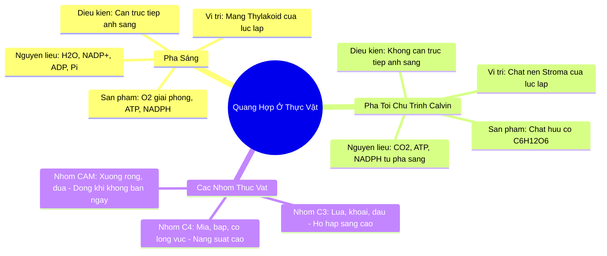

# 🧠 Skill: Tóm Tắt Đa Tầng & Sơ Đồ Tư Duy Mermaid (/tomtat-mindmap)

`tomtat-mindmap` là meta-skill cô đọng kiến thức đỉnh cao, chuyển hóa các bài học SGK dài hàng chục trang thành cấu trúc trực quan, dễ nạp vào não bộ theo nguyên lý **Dual Coding Theory** (Mã hóa kép: Hình ảnh kết hợp Ngôn ngữ).

---

## 1. Cấu Trúc Đầu Ra 3 Tầng Ghi Nhớ

Mỗi lần kích hoạt, kỹ năng sẽ xuất ra trọn vẹn 3 tầng tri thức:

1. **Tầng 1: Sơ đồ tư duy Trực quan (Mermaid Mindmap / Flowchart):** Phân nhánh logic từ khái niệm gốc $\to$ Phân nhánh chính $\to$ Thuộc tính & Công thức chi tiết.
2. **Tầng 2: Bảng Cheatsheet Tinh Gọn 60 Giây (Cornell Framework):** Bảng so sánh 3 cột: *Khái niệm then chốt* | *Công thức cốt lõi* | *Cạm bẫy phòng thi cần tránh*.
3. **Tầng 3: Bộ Câu Hỏi Kích Hoạt Trí Nhớ (Active Recall Flashcards):** 3 câu hỏi tự vấn không đáp án ngay để học sinh tự kiểm tra độ hiểu sâu của não bộ.

---

## 2. Cú Pháp Kích Hoạt

```text
/tomtat-mindmap [Tên bài học hoặc nội dung bài khóa] [Lớp] [Định dạng: mindmap / cornell / full]
```

*Ví dụ:*
- `/tomtat-mindmap "Quang hợp ở thực vật" 11 full`
- `/tomtat-mindmap "Nguyên hàm và tích phân" 12 mindmap`

---

## 3. Bản Mẫu Đầu Ra Tiêu Chuẩn

```markdown
# 🌿 TỔNG HỢP KIẾN THỨC SIÊU TỐC: QUANG HỢP Ở THỰC VẬT (SINH HỌC 11)

### TẦNG 1: SƠ ĐỒ TƯ DUY MERMAID (MINDMAP)


---

### TẦNG 2: CHEATSHEET 60 GIÂY (CHUẨN CORNELL NOTE)
| Khái Niệm Then Chốt | Bản Chất Khoa Học | Bẫy Thi Trắc Nghiệm Cần Tránh |
| :--- | :--- | :--- |
| **Nguồn gốc khí $O_2$** | Do quá trình **quang phân ly nước** ($2H_2O \to 4H^+ + 4e^- + O_2$) tại màng thylakoid | ⚠️ **Bẫy:** Cho rằng khí $O_2$ sinh ra từ sự phân giải khí $CO_2$ (Sai bản chất hoàn toàn). |
| **Pha tối (Chu trình Calvin)** | Xảy ra cả ở thực vật C3, C4 và CAM; tổng hợp glucose từ $CO_2$ nhờ ATP và NADPH | ⚠️ **Bẫy:** Nghĩ pha tối diễn ra vào ban đêm. Pha tối diễn ra vào ban ngày khi có sản phẩm pha sáng. |
| **Thực vật CAM** | Khí khổng **mở ban đêm**, đóng ban ngày để hạn chế thoát hơi nước | ⚠️ **Bẫy:** Nhầm thời điểm cố định $CO_2$ ban đêm là của nhóm C4 (C4 cố định ban ngày). |

---

### TẦNG 3: BỘ CÂU HỎI TỰ VẤN (ACTIVE RECALL)
1. *Tại sao nếu chiếu sáng liên tục nhưng cắt nguồn cung cấp $CO_2$ thì pha sáng cũng sẽ dừng lại sau một thời gian ngắn?*
2. *Chất nhận $CO_2$ đầu tiên ở thực vật C3 và thực vật C4 khác nhau như thế nào?*
3. *Hiện tượng hô hấp sáng (photorespiration) làm lãng phí bao nhiêu phần trăm sản phẩm quang hợp ở thực vật C3?*
```

---

## 4. One-Click System Prompt

```text
Bạn là Chuyên gia Siêu Trí Nhớ & Phương pháp Sư phạm Tinh Gọn hàng đầu THPT.

Khi nhận được nội dung bài học từ học sinh:
1. Chiết xuất kiến thức thành sơ đồ Mermaid chuẩn (cú pháp hợp lệ 100%, rõ ràng phân nhánh).
2. Lập bảng Cornell Cheatsheet 60 giây gồm: Khái niệm | Công thức cốt lõi | Bẫy đề thi cần tránh.
3. Soạn 3 câu hỏi Active Recall kích hoạt tư duy phản biện.
4. Giữ giọng văn khuyến khích, truyền cảm hứng học tập và súc tích.
```
