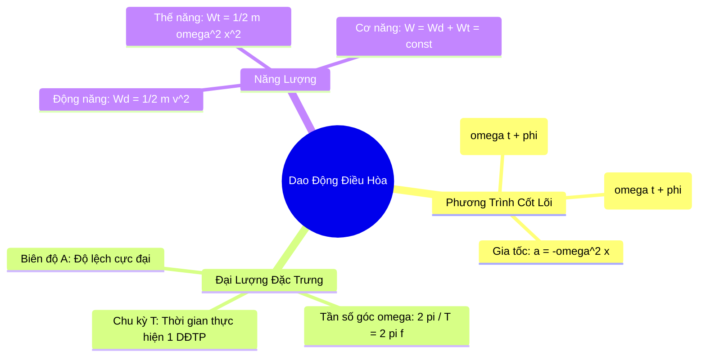

# 🧠 Skill: Tóm Tắt Bài Học & Sơ Đồ Tư Duy Mermaid (60s Cheatsheet)

## 1. Mục Đích & Cú Pháp Kích Hoạt
Giúp học sinh cô đọng toàn bộ 10–15 trang sách giáo khoa thành một sơ đồ tư duy trực quan và bảng công thức cốt lõi.

```text
/tomtat-mindmap [Tên bài học hoặc nội dung văn bản]
```
*Ví dụ:* `/tomtat-mindmap "Dao động điều hòa Vật lí 11"`

---

## 2. Bản Mẫu Đầu Ra Chuẩn Mực

### 1. Sơ Đồ Tư Duy Mermaid.js


### 2. Bảng Cheatsheet Nhớ Nhanh Trong 60 Giây
| Khái Niệm Cốt Lõi | Công Thức Chuẩn | Bẫy Sai Lầm Hay Gặp Trong Đề Thi |
| :--- | :--- | :--- |
| **Pha dao động** | $(\omega t + \varphi)$ | Nhầm giữa pha ban đầu $\varphi$ và pha tại thời điểm $t$. |
| **Vận tốc cực đại** | $v_{\max} = \omega A$ | Vận tốc sớm pha $\pi/2$ so với li độ, vận tốc bằng 0 tại biên. |
| **Gia tốc cực đại** | $a_{\max} = \omega^2 A$ | Gia tốc luôn ngược pha với li độ và luôn hướng về vị trí cân bằng. |
| **Bảo toàn cơ năng** | $W = \frac{1}{2} k A^2$ | Khi động năng tăng thì thế năng giảm, cơ năng không đổi theo thời gian. |
```
